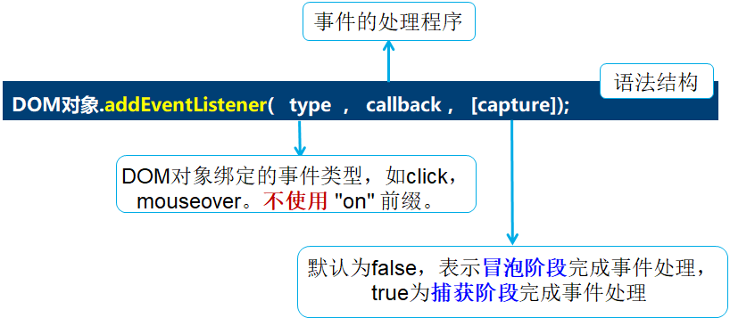

[toc]

# javaScript

## 概述

* JavaScript由**ECMAScript**（JavaScript语法标准）、**DOM**（文档对象模型）、**BOM**（浏览器对象模型）三部分组成。

* 书写位置：

  * 行内式：是将单行或少量的JavaScript代码写在HTML标签的事件属性中（以on开头的属性）

    ~~~html
    <body>
        <input type="button" value="点我" onclick="alert('行内式')" />
    </body>
    ~~~

  * 内嵌式（嵌入式）：使用
    </head>
    ~~~

  * 外部式（外链式）：将JavaScript代码写在一个单独的文件中，一般使用“**js**”作为文件的扩展名

    ~~~html
    <head>
    	<title>外部式</title>
    	
    </head>
    ~~~

* 输入输出语句

  * alert(msg) ：**浏览器**弹出警告框
    
  * console.log(msg) ：**浏览器控制台**输出信息
    
  * prompt(msg)：**浏览器**弹出输入框，用户可以输入内容，返回msg
    
  * confirm(msg)： **浏览器**弹出确认框，用户选择并返回布尔值
    

* 变量： ①只声明不赋值，输出为undefined。②不声明，输出报错。③不声明只赋值，输出正常。
  ①声明赋值 `var a; a = 10; `
  ②初始化 `var a = 10; `
  ③多个变量 `var a = 1, b = 2, c = 3;`
  
* 调试工具：
  在Chrome浏览器中，按**F12键启动开发者工具**后，切换到**“Sources”面板**。

  在**中栏**显示的网页源代码中，单击某一行的行号，即可**添加断点**，再次单击，可以取消断点。
  

## 基础语法

### 数据类型

* `var 变量` 定义数据类型   `typeof 变量` 检测数据类型
* 数字型
  `Number.MAX_VALUE`    数字型最大值        `Number.MIN_VALUE`     数字型最小值
  `Infinity`                     无穷大                    `-Infinity`                   无穷小
  `NAN`                               非数值                     `isNAN()`                       判断是否为非数值型
  ① 转为数字型： `parseInt()` 、`parseFloat()`、 `Number()`、 `- * /`
* 字符串型
  ① 单引号、双引号都可 `var str1 = '单引号字符串'; var str2 = "双引号字符串";`
  ② 单双引号相互嵌套，纯单纯双不能嵌套 
  `var str1 = 'I'm a programmer';` ×         `var str3 = 'I am a programmer";` ×
  ③ `length` 属性，获取长度        `[index]` 数组，获取字符值 index起始0
       `+`  字符串拼接，什么类型和字符串相加都为字符串
  ④ 转换成字符串：`+` 、 `toString()` 、  `String()` 
       \> null 和undefined 不懂使用 `toString()`
       \> 数字型可用 `toString()` 进行进制转换
* undefined 
  ① 只声明不赋值，则默认变量值为undefined
  ② undefined和数字型相加 ==> NAN
* null
  ① null和数字型相加 ==> null转为0,数字型
  ② null和布尔型相加 ==> null转为0，false转为0，true转为1
* 布尔型
  ① 转换成布尔型： `Boolean()` 
       \> 空字符串、0、NaN、null、undefined  ==>  false

### 运算符

* 比较运算符 
  `===` 全等，值和数据类型都要相等			`!==` 不全等，至少值或数据类型其中之一要相等
  \> 其他比较运算符都是比较值的大小
  
* 赋值运算符

  | **运算符** | **运算**           | **示例**          | **结果** |
  | ---------- | ------------------ | ----------------- | -------- |
  | <<=        | 左移位并赋值       | a =  9; a <<= 2;  | a =  36  |
  | >>=        | 右移位并赋值       | a =  -9; a >>= 2; | a =  -3  |
  | >>>=       | 无符号右移位并赋值 | a =  9; a >>>= 2; | a =  2   |
  | &=         | 按位“与”并赋值     | a =  3; a &= 9;   | a = 1    |
  | ^=         | 按位“异或”并赋值   | a =  3; a ^= 9;   | a =  10  |
  | \|=        | 按位“或”并赋值     | a =  3; a \|= 9;  | a =  11  |

### 数组

* 创建数组：[] 或 new Array()
* 获取数组长度： arr.length
  修改数组长度： arr.length = n
  `arr1 = [1,2,3];  arr1.length=2 ==> arr1 = [1,2]`
  `arr2 = [1,2,3];  arr2.length=4 ==> arr2 = [1,2,3,undefined]`
* 创建二维数组：new Array( new Array() , new Array() ) 或 [ [] , [] ]

### 函数

* 声明函数：`function 函数名(){函数体}`

  > 函数的形参和实参可以个数不同：
  > 	实参 > 形参 ：多余的实参会被忽略
  > 	实参 < 形参 ：多出来的形参类似于已声明为赋值，值为undefined
  >
  > ~~~javascript
  > function getSum(num1, num2) {
  >   console.log(num1, num2);
  > }
  > getSum(1, 2, 3);	// 实参数量大于形参数量，输出结果：1 2
  > getSum(1);           // 实参数量小于形参数量，输出结果：1 undefined
  > ~~~
  >
  > 当不确定函数接受了多少个实参时，可用arguments[n]获取实参
  >
  > ~~~javascript
  > function fn() {
  >   console.log(arguments);	  // 输出结果：Arguments(3) [1, 2, 3, …]
  >   console.log(arguments.length);  // 输出结果：3
  >   console.log(arguments[1]);         // 输出结果：2
  > }
  > fn(1, 2, 3);
  > ~~~

* 调用函数：`函数名()`

* 函数表达式：`var sum = function() {}`
  调用函数：`sum()`
  \> 函数表达式的定义必须在调用前

* 回调函数：

  ~~~javascript
  function cal(num1, num2, fn) {
    return fn(num1, num2);
  }
  console.log(cal(45, 55, function (a, b) {
    return a + b;
  }));
  console.log(cal(10, 20, function (a, b) {
    return a * b;
  }));
  ~~~

  \> 一个函数A作为参数传递给一个函数B，然后在B的函数体内调用函数A。此时，称函数A为回调函数

### 对象

* 创建对象方式：① 字面量 ② new Object ③ 构造函数

* 对象格式： `key:value`  ==> `属性名/方法名：对应的值`

  ~~~javascript
  // 1. 字面量
  var 对象名={
  	属性名：属性值，
  	属性名：属性值，
  	……
  	方法名：function(){
      }
  }
  
  // 手动赋值属性或方法来添加成员
  var 对象名 = {};
  对象名.属性名 = '属性值';	
  对象名.方法名 = function() { 
    alert('My 属性名 is ' + this.属性名);	// this代表当前对象
  };	
  
  // 2. new Object
  var obj = new Object();	
  obj.key1 = 'value';		
  obj.key2 = value;
  obj.key3 = 'value';
  obj.function1 = function() {
    console.log('Hello');
  };
  
  // 3. 构造函数创建对象 
  function 构造函数名(参数1，参数2，... ) {
    this.属性 = 属性值;
    this.方法 = function() {
      // 方法体
    }
  }
  var obj = new 构造函数名();
  ~~~

* 访问对象

  > 当对象成员中包含特殊字符时，可以用字符串来表示

  ~~~javascript
  // 访问对象的属性
  object.dataName
  object['dataName']
  // 访问对象的方法
  object.functionName()    
  object.['functionName']() 
  // 特殊字符
  var obj = {
  'name-age': '小明-18'
  };
  console.log(obj['name-age']);  // dataName是特殊字符时常用格式
  ~~~

* 遍历对象的属性和方法 `for (... in ...)`

  ~~~javascript
  // obj为待遍历的对象
  var obj = { name: '小明', age: 18, sex: '男' };
  // 遍历obj对象
  for (var k in obj) {
    // 通过k可以获取遍历过程中的属性名或方法名
    console.log(k);	             // 依次输出属性名
    console.log(obj[k]); 	// 依次输出属性值
  }
  ~~~

* in运算符,判断一个对象中的某个成员是否存在。

  ~~~javascript
  var obj = {name: 'Tom', age: 16};
  console.log('age' in obj);	    // 输出：true，表示对象成员存在
  console.log('gender' in obj);  // 输出：false ，表示对象成员不存在
  ~~~

## 内置对象

查阅JavaScript中的内置对象
MDN：https://developer.mozilla.org/zh-CN/

* Math：不需要实例化对象，用来对数字进行与数学相关的运算
  | **成员**            | **功能**                                                 |
  | ------------------- | -------------------------------------------------------- |
  | PI                  | 获取圆周率，结果为3.141592653589793                      |
  | abs(x)              | 获取x的绝对值，可传入普通数值或是用字符串表示的数值      |
  | max()               | 获取所有参数中的最大值                                   |
  | min()               | 获取所有参数中的最小值                                   |
  | pow(base, exponent) | 获取基数（base）的指数（exponent）次幂，即  baseexponent |
  | sqrt(x)             | 获取x的平方根                                            |
  | ceil(x)             | 获取大于或等于x的最小整数，即向上取整                    |
  | floor(x)            | 获取小于或等于x的最大整数，即向下取整                    |
  | round(x)            | 获取x的四舍五入后的整数值                                |
  | random()            | 获取大于或等于0.0且小于1.0的随机值                       |

* Data：需要实例化对象，Date()是日期对象的构造函数

  ~~~javascript
  // 方式1：没有参数
  var date1 = new Date();  
  // 输出：Wed Oct 16 2019 10:57:56 GMT+0800 (中国标准时间)
  
  // 方式2：传入年、月、日、时、分、秒（月的范围是0~11）
  var date2 = new Date(2019, 10, 16, 10, 57, 56);
  // 输出：Sat Nov 16 2019 10:57:56 GMT+0800 (中国标准时间)
  
  // 方式3：用字符串表示日期和时间
  var date3 = new Date('2019-10-16 10:57:56');
  // 输出：Wed Oct 16 2019 10:57:56 GMT+0800 (中国标准时间)
  ~~~

  | **方法**                | **作用**                                                |
  | ----------------------- | ------------------------------------------------------- |
  | getFullYear()           | 获取表示年份的4位数字，如2020                           |
  | getMonth()              | 获取月份，范围0~11（0表示一月，1表示二月，依次类推）    |
  | getDate()               | 获取月份中的某一天，范围1~31                            |
  | getDay()                | 获取星期，范围0~6（0表示星期日，1表示星期一，依次类推） |
  | getHours()              | 获取小时数，返回0~23                                    |
  | getMinutes()            | 获取分钟数，范围0~59                                    |
  | getSeconds()            | 获取秒数，范围0~59                                      |
  | getMilliseconds()       | 获取毫秒数，范围0~999                                   |
  | getTime()  \| valueOf() | 获取时间戳，Date.now() 也可                             |
  |                         |                                                         |

  > “+”运算符转换为数值型：`+new Date();`  ==> 返回时间戳

* 数组类型检测：instanceof运算符 和 使用Array.isArray()方法

  ~~~javascript
  var arr = [];
  var obj = {};
  // 第1种方式
  console.log(arr instanceof Array);	// 输出结果：true
  console.log(obj instanceof Array);	// 输出结果：false
  // 第2种方式
  console.log(Array.isArray(arr));	// 输出结果：true
  console.log(Array.isArray(obj));	// 输出结果：false
  ~~~

  | **方法名**      | **功能描述**                                                 | **返回值**             |
  | --------------- | ------------------------------------------------------------ | ---------------------- |
  | push(参数1…)    | 数组末尾添加一个或多个元素，会修改原数组                     | 返回数组的新长度       |
  | unshift(参数1…) | 数组开头添加一个或多个元素，会修改原数组                     | 返回数组的新长度       |
  | pop()           | 删除数组的最后一个元素，若是空数组则返回undefined，会修改原数组 | 返回删除的元素的值     |
  | shift()         | 删除数组的第一个元素，若是空数组则返回undefined，会修改原数组 | 返回第一个元素的值     |
  | reverse()       | 颠倒数组中元素的位置，该方法会改变原数组                     | 返回新数组的长度       |
  | sort()          | 对数组的元素进行排序，该方法会改变原数组                     | 返回新数组的长度       |
  | indexOf()       | 返回在数组中可以找到给定值的第一个索引，检索方式与运算符“===”相同，即只有全等时才会返回比较成功的结果。 | 如果不存在，则返回-1   |
  | lastIndexOf()   | 返回指定元素在数组中的最后一个的索引，检索方式与运算符“===”相同，即只有全等时才会返回比较成功的结果。 | 如果不存在则返回-1     |
  | toString()      | 把数组转换为字符串，逗号分隔每一项                           |                        |
  | join('分隔符')  | 将数组的所有元素连接到一个字符串中                           |                        |
  | fill()          | 用一个固定值填充数组中指定下标范围内的全部元素  ，在执行后皆会对原数组产生影响。 |                        |
  | splice()        | 数组删除，参数为splice(第几个开始, 要删除个数)，在执行后皆会对原数组产生影响。 | 返回被删除项目的新数组 |
  | slice()         | 数组截取，参数为slice(begin, end)                            | 返回被截取项目的新数组 |
  | concat()        | 连接两个或多个数组，不影响原数组                             | 返回一个新数组  *      |

* 字符串：new String()来创建

  ~~~javascript
  // 方式一：
  var str = new String('apple');
  // 方式二：
  var str = new String();
  ~~~

  | **方法**                                                     | **功能描述**                                                 |
  | ------------------------------------------------------------ | ------------------------------------------------------------ |
  | indexOf(searchValue)   \| indexOf(searchValue，index)        | 获取searchValue在字符串中首次出现的位置                      |
  | lastIndexOf(searchValuex)   \| lastIndexOf(searchValue，index) | 获取searchValue在字符串中最后出现的位置                      |
  | charAt(index)                                                | 获取index位置的字符，位置从0开始计算                         |
  | charCodeAt(index)                                            | 获取index位置的字符的ASCII码                                 |
  | str[index]                                                   | 获取指定位置处的字符（HTML5新增）                            |
  | concat(str1,  str2, str3…)                                   | 连接多个字符串                                               |
  | slice(start,[ end])                                          | 截取从start位置到end位置之间的一个子字符串                   |
  | substring(start[, end])                                      | 截取从start位置到end位置之间的一个子字符串，基本和slice相同，但是不接收负值 |
  | substr(start[,  length])                                     | 截取从start位置开始到length长度的子字符串                    |
  | toLowerCase()                                                | 获取字符串的小写形式                                         |
  | toUpperCase()                                                | 获取字符串的大写形式                                         |
  | split([separator[, limit])                                   | 使用separator分隔符将字符串分隔成数组，limit用于限制数量     |
  | replace(str1, str2)                                          | 使用str2替换字符串中的str1，返回替换结果，只会替换第一个字符 |
  
  ~~~javascript
  var str = 'HelloWorld';
  str.concat('!');  // 在字符串末尾拼接字符，结果：HelloWorld!
  str.slice(1, 3);   // 截取从位置1开始包括到位置3的范围内的内容，结果：el
  str.substring(5);      // 截取从位置5开始到最后的内容，结果：World
  str.substring(5, 7);  // 截取从位置5开始到位置7范围内的内容，结果：Wo
  str.substr(5);           // 截取从位置5开始到字符串结尾的内容，结果：World
  str.substring(5, 7);  // 截取从位置5开始到位置7范围内的内容，结果：Wo
  str.toLowerCase();  // 将字符串转换为小写，结果：helloworld
  str.toUpperCase();  // 将字符串转换为大写，结果：HELLOWORLD
  str.split('l');	  // 使用“l”切割字符串，结果：["He", "", "oWor", "d"]
  str.split('l', 3);	  // 限制最多切割3次，结果：["He", "", "oWor"]
  str.replace('World', '!'); // 替换字符串，结果："Hello!"
  ~~~
  
* 值类型和引用类型
  \> 引用类型的特点是，变量中保存的仅仅是一个引用的地址，当对变量进行赋值时，并不是将对象复制了一份，而是将两个变量指向了同一个对象的引用。
  
  \> 当obj1和obj2两个变量指向了同一个对象后，如果给其中一个变量（如obj1)重新赋值为其他对象，或者重新赋值为其他值，则obj1将不再引用原来的对象，但obj2仍然在引用原来的对象。

  ~~~javascript
  var obj1 = { name: '小明', age: 18 };
  var obj2 = obj1;
  // obj1指向了一个新创建的对象
  obj1 = { name: '小红', age: 17 };
  // obj2仍然指向原来的对象
  console.log(obj2.name);		// 输出结果：小明
  ~~~

  \> 当一个对象只被一个变量引用的时候，如果这个变量又被重新赋值，则该对象就会变成没有任何变量引用的情况，这时候就会由JavaScript的垃圾回收机制自动释放。
  \> 如果在函数的参数中修改对象的属性或方法，则在函数外面通过引用这个对象的变量访问时的结果也是修改后的。

  ~~~javascript
  function change(obj) {
    obj.name = '小红';	// 在函数内修改了对象的属性
  }
  var stu = { name: '小明', age: 18 };
  change(stu);
  console.log(stu.name);	// 输出结果：小红
  ~~~

## DOM

JavaScript语言由3部分组成，分别是ECMAScript、BOM和DOM，其中ECMAScript是JavaScript语言的核心，而Web API包括BOM和DOM两部分。**Web API**是浏览器提供的一套操作浏览器功能和页面元素的接口。

* DOM：文档对象模型，是W3C组织推荐的处理可扩展标记语言（HTML或者XML）的标准编程接口。W3C定义了一系列的DOM接口，利用DOM可以完成对HTML文档内所有元素的**获取**、**访问**、**标签属性**和**样式的设置**等操作。

* DOM树：DOM中将HTML文档视为树结构，被称之为**文档树模型**，把文档映射成树形结构，通过节点对象对其处理，处理的结果可以加入到当前的页面。树形结构如图所示。
  

  > **文档**（document）：可以把一个页面当成一个文档
  >
  > **元素**（element）：页面中的所有标签都是元素
  >
  > **节点**（node）：网页中的所有内容，在文档树中都是节点（如：元素节点、属性节点、文本节点、注释节点等），在DOM中会把所有的节点都看作是对象，这些对象拥有自己的属性和方法

### 文档

* 获取元素

| 函数                                                         | 说明             | 返回                                                         | 注意                                                         |
| ------------------------------------------------------------ | ---------------- | ------------------------------------------------------------ | ------------------------------------------------------------ |
| document.getElementById('id')                                | 根据id获取元素   | 返回的是拥有指定id的元素，如果没有找到指定id的元素则返回null，如果存在多个指定id的元素则返回undefined。 |                                                              |
| document.getElementsByTagName('标签名'); element.getElementsByTagName('标签名'); | 根据标签获取元素 | 返回的不是单个元素对象，而是一个**集合**。这个集合是一个类数组对象，或称为伪数组，它可以像数组一样用索引来访问元素，但不能使用push()等方法，使用Array.isArray()也可以证明它不是一个数组。 | getElementsByTagName()方法获取到的集合是动态集合，也就是说，当页面增加了标签，这个集合中也会自动增加元素。 |
| document.getElementsByName('name名');                        | 根据name获取元   |                                                              |                                                              |
| querySelector()                                              |                  | 返回指定选择器的第一个元素对象                               |                                                              |
| querySelectorAll()                                           |                  | 返回指定选择器的所有元素对象集合                             |                                                              |
| getElementsByClassName()                                     | 根据类名获取     |                                                              |                                                              |

~~~html
<!-- document.getElementById -->

你好

 
~~~

~~~html
<!-- document.getElementsByClassName -->
<body>
  英语 数学
  语文 物理
  
</body>
~~~

~~~html
<!-- querySelector() | querySelectorAll() -->

~~~

| 属性                     | 作用                          |
| ------------------------ | ----------------------------- |
| document.body            | 返回文档的body元素            |
| document.title           | 返回文档的title元素           |
| document.documentElement | 返回文档的html元素            |
| document.forms           | 返回对文档中所有Form对象引用  |
| document.images          | 返回对文档中所有Image对象引用 |

### 元素

* 操作内容

  | **方法**            | **作用**                                                     | 注意                                          |
  | ------------------- | ------------------------------------------------------------ | --------------------------------------------- |
  | element.innerHTML   | 设置或返回元素开始和结束标签之间HTML。包括HTML标签，同时保留空格和换行 | innerHTML在使用时会保持编写的格式以及标签样式 |
  | element.innerText   | 设置或返回元素的文本内容，在返回的时候会去除HTML标签和多余的空格、换行，在设置的时候会进行特殊字符转义 | innerText去掉所有格式以及标签的纯文本内容     |
  | element.textContent | 设置或者返回指定节点的文本内容，同时保留空格和换行           | textContent属性在去掉标签后会保留文本格式     |

* 操作属性

  > img图片元素来说，可以操作它的src、title属性等
  > input元素来说，可以操作它的disabled、checked、selected属性等
  > 元素，可以操作增加属性a

  ~~~html
  <body>
    

      <label for="">
        
      </label>
      <input type="password" name="" id="pwd">
    

      
    
  </body>
  ~~~

  排他思想：

  ~~~html
  <body>
    <button>按钮1</button>
    <button>按钮2</button>
    <button>按钮3</button>
    <button>按钮4</button>
    <button>按钮5</button>
  </body>
  
  ~~~

  

* 操作样式

  1）操作style属性：元素对象.style.样式属性名

  > 样式属性名对应CSS样式名，但需要去掉CSS样式名里的半字线“-”，并将半字线后面的英文的首字母大写

  | **方法**        | **作用**                                 |
  | --------------- | ---------------------------------------- |
  | background      | 设置或返回元素的背景属性                 |
  | backgroundColor | 设置或返回元素的背景色                   |
  | display         | 设置或返回元素的显示类型                 |
  | fontSize        | 设置或返回元素的字体大小                 |
  | height          | 设置或返回元素的高度                     |
  | left            | 设置或返回定位元素的左部位置             |
  | listStyleType   | 设置或返回列表项标记的类型               |
  | overflow        | 设置或返回如何处理呈现在元素框外面的内容 |
  | textAlign       | 设置或返回文本的水平对齐方式             |
  | textDecoration  | 设置或返回文本的修饰                     |
  | textIndent      | 设置或返回文本第一行的缩进               |
  | transform       | 向元素应用2D或3D转换                     |

  2）操作className属性：元素对象.className

  > 如果元素有多个类名，在className中以空格分隔。

  ~~~html
  
  
  <body>
    <div class="first">文本

  </body>
  ~~~

### 节点

HTML文档可以看作是一个节点树，网页中的所有内容都是**节点**，一般来说，节点至少拥有nodeType（节点类型）、nodeName（节点名称）和nodeValue（节点值）这3个基本属性。

> 元素节点，**nodeType**为1
>
> 属性节点，**nodeType**为2
>
> 文本节点，**nodeType**为3，文本节点包含文字、空格、换行等

DOM根据HTML中各节点的不同作用，可将其分别划分为标签节点（元素节点）、文本节点和属性节点。

> **根节点**：<html>标签是整个文档的根节点，有且仅有一个
>
> **父节点**：指的是某一个节点的上级节点
>
> **子节点**：指的是某一个节点的下级节点
>
> **兄弟节点**：两个节点同属于一个父节点

* 获取父级节点
  `语法格式为：obj.parentNode`

  > 可以使用**parentNode**属性来获得离当前元素最近的一个父节点【DOM对象】，如果找不到父节点就返回为 null

  ~~~html
  <body>
    <div class="demo">
      <div class="box"><span class="child">span元素

    

    
  </body>
  ~~~

* 获取子级节点
  `方式1：obj.childNodes`

  > **childNodes属性**获得的是当前元素的所有子节点的集合，该集合为即时更新的集合。
  > 返回的是**NodeList对象的集合**，返回值里面包含了元素节点、文本节点等其他类型的节点。

  ~~~html
  <ul><li>我是li</li><li>我是li</li><li>我是li</li><li>我是li</li></ul>
  
  ~~~

  `方式2：obj.children`

  > **children**是一个可读的属性，返回所有子元素节点。
  > 只返回子元素节点，其余节点不返回，目前各大浏览器都支持该属性，在实际开发中推荐使用children。

  ~~~html
  <ol>
    <li>我是li</li>
    <li>我是li</li>
    <li>我是li</li>
    <li>我是li</li>
  </ol>
  
  ~~~

  > VS：
  > 前者用于节点操作，返回值是NodeList对象集合，
  > 后者用于元素操作，返回的是HTMLCollection对象集合。

  `方式3：obj.firstChild obj.lastChild`

  > 使用firstChild属性和lastChild属性获取子节点，前者返回第一个子节点，后者返回的是最后一个子节点，如果找不到则返回null。需要注意的是它们的返回值包括文本节点和元素节点等。
  >
  > 实际开发中，firstChild 和lastChild 包含其他节点，操作不方便，在实际开发中通常使用“obj.children[索引] ”的方式来获取子元素节点。

  ~~~javascript
  obj.children[0]			   // 获取第一个子元素节点
  obj.children[obj.children.length - 1]   // 获取最后一个子元素节点
  ~~~

* 获取兄弟节点
  `语法格式为：obj.nextSibling obj.previousSibling`

  > 可以使用**nextSibling**属性获得下一个兄弟节点，或者使用**previousSibling**属性获得上一个兄弟节点，它们的返回值包含元素节点或者文本节点等。如果找不到，就返回null。

* 节点的增删创

  | 函数                              | 说明                                                   |
  | --------------------------------- | ------------------------------------------------------ |
  | document.createElement('tagName') | 创建多个元素效率稍微低一点，但是结构更加清晰           |
  | document.write()                  | 创建元素，如果页面文档流加载完毕，再调用会导致页面重绘 |
  | element.innerHTML                 | 将内容写入某个DOM节点，不会导致页面全部重绘            |
  | appendChild()                     | 将一个节点添加到指定父节点的子节点列表末尾             |
  | insertBefore(child, 指定元素)     | 将一个节点添加到父节点的指定子节点前面                 |
  | removeChild(child)                | 删除节点，该方法从DOM中删除一个子节点，返回删除的节点  |

  ~~~html
  <body>
    <textarea name="" id=""></textarea>   // 用户输入留言
    <button>发布</button>
    <ul></ul>                                              // 用于展示留言模块
  </body>
  
  
  ~~~

### 事件

事件是指可以被JavaScript侦测到的行为，是一种“触发-响应”的机制。这些行为指的就是页面的加载、鼠标单击页面、鼠标指针滑过某个区域等具体的动作，它对实现网页的交互效果起着重要的作用。

* 事件三要素是指事件源、事件类型和事件处理程序这3部分

  > 事件源：触发事件的元素（谁触发了事件）
  >
  > 事件类型：如 click 单击事件（触发了什么事件）
  >
  > 事件处理程序：事件触发后要执行的代码（函数形式），也称事件处理函数（触发事件以后要做什么）

* 注册事件
  \> 传统方式

  ~~~html
  <button type=“button” onclick=“showfun()”>ok</button>
  
  <!-- 缺点：HTML与JS强耦合
  优点：不需要操作DOM来完成事件的绑定。 -->
  ~~~

  ~~~javascript
  btn.onclick = function () { …… }
  
  /* 元素对象.事件 = 事件的处理程序;
  通过给事件处理属性赋值null来解绑事件。
  缺点：一个处理程序无法同时绑定多个处理函数 */
  ~~~

  \> 监听方式
  特点：可以给同一个DOM对象的同一个事件添加多个事件处理程序

  ​      

  

* 删除事件

  ~~~javascript
  DOM对象.onclick = null;   // 传统方式删除事件
  DOM对象.detachEvent(type, callback);	     // 早期版本IE浏览器
  DOM对象.removeEventListener(type, callback);  // 标准浏览器
  ~~~

* DOM事件流
  \> 事件流是指当事件发生时，会在发生事件的元素节点与DOM树根节点之间按照特定的顺序进行传递
  \> 事件传递有两种方式：
  **冒泡**：从发生事件的元素节点到DOM树的根节点。
  **捕获**：从DOM树的最上层开始出发一直到发生事件的元素节点

  \> addEventListener() 方法可以指定 “capture” 参数来设置传递类型

* 事件委托
  \> 不给子元素注册事件，给父元素注册事件，让处理代码在父元素的事件中执行。
  \> 优点：只操作了一次DOM ，提高了程序的性能。

#### 触发事件对象
* 当一个事件发生后，跟事件相关的一系列信息数据的集合都放到这个对象里面，这个对象就是**event**。只有有了事件，event才会存在，它是系统自动创建的，不需要传递参数。

  ~~~javascript
  var 事件对象 = window.event        	// 早期IE内核浏览器
  DOM对象.事件 = function (event) {}	// W3C内核浏览器
  
  //处理兼容性问题
  div.onclick = function(e) {
    e = e || window.event ;
    var target = e.target || e.srcElement ;
    console.log(target);
  }
  ~~~

* 因为在事件触发时就会产生事件对象，并且系统会以实参的形式传给事件处理函数。所以，在事件处理函数中需要用一个形参来接收事件对象event。

* 事件对象event中会包含一些所有事件都有的属性和方法

  > **e.target**返回的是**触发事件的对象**，而**this**返回的是**绑定事件的对象**。

  | **属性**            | **说明**                 | **浏览器**           | 说明                                                         |
  | ------------------- | ------------------------ | -------------------- | ------------------------------------------------------------ |
  | e.target            | 返回触发事件的对象       | 标准浏览器           |                                                              |
  | e.srcElement        | 返回触发事件的对象       | 非标准IE 6-IE 8使用  |                                                              |
  | e.type              | 返回事件的类型           | 所有浏览器           |                                                              |
  | e.stopPropagation() | 阻止事件冒泡             | 标准浏览器           |                                                              |
  | e.cancelBubble      | 阻止事件冒泡             | 非标准IE  6-IE 8使用 | 调用stopPropagation()方法和设置cancelBubble属性，实现禁止所有浏览器的事件冒泡行为 |
  | e.preventDefault()  | 阻止默认事件（默认行为） | 标准浏览器           | 只有事件对象的cancelable属性设置为true，才可以使用preventDefault()方法取消其默认行为。 |
  | e.returnValue       | 阻止默认事件（默认行为） | 非标准IE  6-IE 8使用 | 可利用事件对象的preventDefault()方法和returnValue属性，禁止所有浏览器执行元素的默认行为。 |

  ~~~html
  <!--   阻止默认事件 --> 
  <a href="http://www.baidu.com">百度</a>
  
  ~~~

  ~~~javascript
  <!--   阻止事件冒泡   -->
  if (window.event) {		// 早期版本的浏览器
    window.event.cancelBubble = true;
  } else {				// 标准浏览器
    e.stopPropagation();
  }

#### 鼠标事件

| **事件名称** | **事件触发时机**                 |
| ------------ | -------------------------------- |
| onclick      | 单击鼠标左键时触发               |
| onfocus      | 获得鼠标指针焦点触发             |
| onblur       | 失去鼠标指针焦点触发             |
| onmouseover  | 鼠标指针经过时触发               |
| onmouseout   | 鼠标指针离开时触发               |
| onmousedown  | 当按下任意鼠标按键时触发         |
| onmouseup    | 当释放任意鼠标按键时触发         |
| onmousemove  | 在元素内当鼠标指针移动时持续触发 |
| contextmenu  | 单击鼠标右键时触发               |
| selectstart  | 鼠标开始选择文字时就会触发       |

* 鼠标事件对象：MouseEvent
  可以用来获取当前鼠标的位置信息

  | **位置属性（只读）** | **描述**                                                  |
  | -------------------- | --------------------------------------------------------- |
  | clientX              | 鼠标指针位于浏览器页面当前窗口可视区的水平坐标（X轴坐标） |
  | clientY              | 鼠标指针位于浏览器页面当前窗口可视区的垂直坐标（Y轴坐标） |
  | pageX                | 鼠标指针位于文档的水平坐标（X轴坐标），IE  6~IE 8不兼容   |
  | pageY                | 鼠标指针位于文档的垂直坐标（Y轴坐标），IE 6~IE 8不兼容    |
  | screenX              | 鼠标指针位于屏幕的水平坐标（X轴坐标）                     |
  | screenY              | 鼠标指针位于屏幕的垂直坐标（Y轴坐标）                     |
  
  ~~~html
  
  <body>
         // 需要移动的图片
  </body>
  
  ~~~
  

#### 键盘事件

| **事件名称** | **事件触发时机**                                             |
| ------------ | ------------------------------------------------------------ |
| keypress     | 某个键盘按键被按下时触发，不识别功能键，如Ctrl、Shift、箭头等 |
| keydown      | 某个键盘按键被按下时触发                                     |
| keyup        | 某个键盘按键被松开时触发                                     |

| 事件名称 | 保存的按键值 | 按住不放           | 字母大小 |
| -------- | ------------ | ------------------ | -------- |
| keypress | ASCII码      | 重复触发该对应事件 | 区分     |
| keydown  | 虚拟键码     | 重复触发该对应事件 | 不区分   |
| keyup    | 虚拟键码     |                    | 不区分   |

* 键盘事件对象：KeyBoardEvent

  | 属性（只读） | **描述**                |
  | ------------ | ----------------------- |
  | keyCode      | 可以得到相应的ASCII码值 |

  ~~~html
  <body>
    <input type="text">
    
  </body>
  ~~~

## BOM

浏览器对象模型（Brower Object Model，BOM）提供了独立于内容而与浏览器窗口进行交互的对象，其核心对象是window

* BOM与DOM的区别

  \> DOM是文档对象模型，把文档当作一个对象来看待，它的顶级对象是document
  \> BOM是浏览器对象模型，是把浏览器当做一个对象来看待，它的顶级对象是window   

* 定义在全局作用域中的变量、函数都会变成window对象的属性和方法

  ~~~html
  
  ~~~

* window对象的常见事件

  | 事件名称                  |                                                              |
  | ------------------------- | ------------------------------------------------------------ |
  | window.onload             | 窗口（页面）加载事件，当**文档内容**（包括图像、脚本文件、CSS文件等）完全加载完成会触发该事件，调用该事件对应的事件处理函数 |
  | document.DOMContentLoaded | 加载事件，会在**DOM**加载完成时触发，这里所说的加载不包括CSS样式表、图片和flash动画等额外内容的加载 |
  | window.onresize           | 调整window窗口大小                                           |

  ~~~javascript
  /* window.onload */
  // 方式1
  window.onload = function () {};
  // 方式2
  window.addEventListener('load', function () {});
  
  /* window.onresize */
  // 方式1
  window.onresize = function () {};
  // 方式2
  window.addEventListener('resize', function () {});
  
  ~~~

* 定时器方法       

  | **方法**        | **说明**                                           |
  | --------------- | -------------------------------------------------- |
  | setTimeout()    | 在指定的毫秒数后调用函数或执行一段代码             |
  | setInterval()   | 按照指定的周期（以毫秒计）来调用函数或执行一段代码 |
  | clearTimeout()  | 取消由setTimeout()方法设置的定时器                 |
  | clearInterval() | 取消由setInterval()设置的定时器                    |

  ~~~html
  <body>
    
  </body>
  ~~~

*  执行机制
  \> **单线程**：JavaScript语言的一大特点就是单线程，也就是说，同一个时间只能做一件事。
  \> **同步**：前一个任务结束后再执行后一个任务。
  			放在主线程上优先执行，形成一个执行栈

  \> **异步**：在做一件事件的同时，可以去处理其他的事情。
  			会添加到任务队列中（任务队列也称为消息队列）
  \> JS的异步是通过**回调函数实现**的，异步任务有以下三种类型：
  	1）普通事件，如click、resize等
  	2）资源加载，如load、error等
  	3）定时器，如setInterval、setTimeout等

  \> 执行流程：

  1. 先执行执行栈中的同步任务
  2. 异步任务（回调函数）放入任务队列中
  3. 一旦执行栈中的所有同步任务执行完毕，系统就会再按次序读取任务队列中的异步任务，于是被读取的异步任务结束等待状态，进入执行栈，开始执行。

* location：获取或设置窗体的URL，并且可以用于解析URL。

  | **属性**          | **说明**                                         |
  | ----------------- | ------------------------------------------------ |
  | location.search   | 返回（或设置）当前URL的查询部分（“?”之后的部分） |
  | location.hash     | 返回一个URL的锚部分（从“#”开始的部分）           |
  | location.host     | 返回一个URL的主机名和端口                        |
  | location.hostname | 返回URL的主机名                                  |
  | location.href     | 获取或设置完整的URL                              |
  | location.pathname | 返回URL的路径名                                  |
  | location.port     | 返回一个URL服务器使用的端口号                    |
  | location.protocol | 返回一个URL协议                                  |
  
  ~~~html
  
  ~~~
  
  | **方法**  | **说明**                                   |
  | --------- | ------------------------------------------ |
  | assign()  | 载入一个新的文档                           |
  | reload()  | 重新加载当前文档                           |
  | replace() | 用新的文档替换当前文档，覆盖浏览器当前记录 |
  
* navigator对象

  | **属性**      | **说明**                               |
  | ------------- | -------------------------------------- |
  | appCodeName   | 返回浏览器的内部名称                   |
  | appName       | 返回浏览器的完整名称                   |
  | appVersion    | 返回浏览器的平台和版本信息             |
  | cookieEnabled | 返回指明浏览器中是否启用Cookie的布尔值 |
  | platform      | 返回运行浏览器的操作系统平台           |

  | 方法          | **说明**                   |
  | ------------- | -------------------------- |
  | javaEnabled() | 指定是否在浏览器中启用Java |

* history对象

  | **属性**       | **说明**               |
  | -------------- | ---------------------- |
  | history.length | 返回历史列表中的网址数 |
  
  | 方法      | **说明**                        |
  | --------- | ------------------------------- |
  | back()    | 加载history列表中的前一个URL    |
  | forward() | 加载history列表中的下一个URL    |
  | go()      | 加载history列表中的某个具体页面 |

## CSS组合器

# jquery

* jQuery是一个快速、简洁的JavaScript库

* Query是查询；意思就是查询js，把js中的DOM操作做了封装，我们可以快速的查询使用里面的功能。

* 步骤：

  1. 下载

  2. 引入

     ~~~html
     <!-- 下载的jquery-3.6.0.min.js文件放在网页的同一目录下 -->
     
     ~~~

  3. 使用

     ~~~javascript
     // jQuery代码（为了方便对比，将代码分成两行书写）
     var div = $("div");	// 获取元素
     div.hide(); // 对元素进行操作
     
     // JavaScript原生代码
     var div = document.querySelector('div');  // 获取元素
     div.style.display = 'none’; // 对元素进行操作
     ~~~

* 加载事件

  ~~~javascript
  // 语法1（简写形式）
  $(function() {    
      // 页面DOM加载后执行的代码    
  });
  
  // 语法2（完整形式）
  $(document).ready(function() {
    // 等着页面DOM加载完成后执行的代码
  });
  ~~~

* jQuery对象：$是jQuery的别称，在代码中可以用jQuery代替$

  ~~~javascript
  // 使用“$”
  $(function () {
    $("div").hide();
  });
  
  // 使用“jQuery”
  jQuery(function () {
    jQuery("div").hide();
  });
  ~~~

* DOM对象与jQuery对象相互转换

  ~~~javascript
  // 从jQuery对象中取出DOM对象
  $("div")[0]; // 方式1
  $("div").get(0); // 方式2
  
  // 取出DOM对象后就可以用DOM方式操作元素
  $("div")[0].style.display = "none";
  
  var myDiv = document.querySelector('div’);   // 获取DOM对象
  var div = $(myDiv);	      // 转换成jQuery对象
  div.hide();                            // 调用jQuery对象的方法
  ~~~

* 选择器
  **基本选择器**    
  
  | **名称**   | **用法**        | **描述**                                 |
  | ---------- | --------------- | ---------------------------------------- |
  | id选择器   | $("#id")        | 获取指定id的元素                         |
  | 全选选择器 | $("*")          | 匹配所有元素                             |
  | 类选择器   | $(".class")     | Index页面的结构文件获取同一类class的元素 |
  | 标签选择器 | $("div")        | 获取相同标签名的所有元素                 |
  | 并集选择器 | $("div,p,li")   | 选取多个元素                             |
  | 交集选择器 | $("li.current") | 交集元素                                 |
  
  **层级选择器**        
  
  | **名称**   | **用法**      | **描述**               |
  | ---------- | ------------- | ---------------------- |
  | 子代选择器 | $("ul  > li") | 子代选择器获取子级元素 |
  | 后代选择器 | $("ul  li")   | 后代选择器获取后代元素 |
  
  **筛选选择器**
  
  | **名称**   | **用法**      | **描述**                                     |
  | ---------- | ------------- | -------------------------------------------- |
  | :first     | $("li:first") | $("li:first")获取第一个li元素                |
  | :last      | $("li:last")  | $("li:last")获取最后一个li元素               |
  | :eq(index) | $("li:eq(2)") | $("li:eq(2)")获取li元素，选择索引为2的元素   |
  | :odd       | $("li:odd")   | $("li:odd")获取li元素，选择索引为奇数的元素  |
  | :even      | $("li:even")  | $("li:even")获取li元素，选择索引为偶数的元素 |
  
  **获取同级元素**
  
  | **选择器**       | **功能描述**                     | **示例**                                                     |
  | ---------------- | -------------------------------- | ------------------------------------------------------------ |
  | prev  + next     | 获取当前元素紧邻的下一个同级元素 | $("div  + .title") 获取紧邻
的下一个class名为title的兄弟节点 |
  | prev  ~ siblings | 获取当前元素后的所有同级元素     | $(".bar  ~ li")获取class名为bar的元素后的所有同级元素节点<li> |
  
  **筛选元素**
  
  | **选择器**      | **功能描述**                              | **示例**                                                     |
  | --------------- | ----------------------------------------- | ------------------------------------------------------------ |
  | :gt(index)      | 获取索引大于index的元素                   | $("li:gt(3)") 获取索引大于3的所有<li>元素               |
  | :lt(index)      | 获取索引小于index的元素                   | $("li:lt(3)") 获取索引小于3的所有<li>元素               |
  | :not(seletor)   | 获取除指定的选择器外的其他元素            | $("li:not(li:eq(3))") 获取除索引为3外的所有<li>元素     |
  | :focus          | 匹配当前获取焦点的元素                    | $("input:focus") 匹配当前获取焦点的<input>元素          |
  | :animated       | 匹配所有正在执行动画效果的元素            | $("div:not(:animated)") 匹配当前没有执行动画的
元素 |
  | :target         | 选择由文档URI的格式化识别码表示的目标元素 | 若URI为http://example.com/#foo， 则$("div:target")将获取
元素 |
  | :contains(text) | 获取内容包含text文本的元素                | $("li:contains('js')") 获取内容中含“js”的<li>元素       |
  | :empty          | 获取内容为空的元素                        | $("li:empty") 获取内容为空的<li>元素                    |
  | :has(selector)  | 获取内容包含指定选择器的元素              | $("li:has('a')") 获取内容中含<a>元素的所有<li>元素      |
  | :parent         | 选取带有子元素或包含文本的元素            | $("li:parent") 选取带有子元素或包含文本的li元素         |
  | :hidden         | 获取所有隐藏元素                          | $("li:hidden")获取所有隐藏的<li>元素                         |
  | :visible        | 获取所有可见元素                          | $("li:visible")获取所有可见的<li>元素                        |
  
  **属性选择器**
  
  | **选择器**                | **功能描述**                              | **示例**                                                     |
  | ------------------------- | ----------------------------------------- | ------------------------------------------------------------ |
  | [attr]                    | 获取具有指定属性的元素                    | $("div[class]") 获取含有class属性的所有
元素        |
  | [attr=value]              | 获取属性值等于value的元素                 | $("div[class='current']") 获取class等于current的所有
元素 |
  | [attr!=value]             | 获取属性值不等于value的元素               | $("div[class!='current']") 获取class不等于current的所有
元素 |
  | [attr^=value]             | 获取属性值以value开始的元素               | $("div[class^='box']") 获取class属性值以box开始的所有
元素 |
  | [attr$=value]             | 获取属性值以value结尾的元素               | $("div[class$='er']") 获取class属性值以er结尾的所有
元素 |
  | [attr*=value]             | 获取属性值包含value的元素                 | $("div[class*='-']") 获取class属性值中含有“-”符号的所有
元素 |
  | [attr~=value]             | 获取元素的属性值包含一个value，以空格分隔 | $("div[class~='box']") 获取class属性值等于“box”或通过空格分隔并含有box的
元素，如“t  box” |
  | [attr1]\[attr2]...[attrN] | 获取同时拥有多个属性的元素                | $("input\[id][name$='usr']") 获取同时含有id属性和属性值以usr结尾的name属性的<input>元素 |
  
  **子元素选择器**
  
  | **选择器**                           | **功能描述**                                                 |
  | ------------------------------------ | ------------------------------------------------------------ |
  | :nth-child(index/even/odd/公式)      | 索引index默认从1开始，匹配指定index索引、偶数、奇数或符合指定公式（如2n，n默认从0开始）的子元素 |
  | :first-child                         | 获取第一个子元素                                             |
  | :last-child                          | 获取最后一个子元素                                           |
  | :only-child                          | 如果当前元素是唯一的子元素，则匹配                           |
  | :nth-last-child(index/even/odd/公式) | 选择所有它们父元素的第n个子元素。计数从最后一个元素开始到第一个 |
  
  **表单选择器**
  
  | **选择器** | **功能描述**                                             |
  | ---------- | -------------------------------------------------------- |
  | :input     | 获取页面中的所有表单元素，包含<select>以及<textarea>元素 |
  | :text      | 选取页面中的所有文本框                                   |
  | :password  | 选取所有的密码框                                         |
  | :radio     | 选取所有的单选按钮                                       |
  | :checkbox  | 选取所有的复选框                                         |
  | :submit    | 获取submit提交按钮                                       |
  | :reset     | 获取reset重置按钮                                        |
  | :image     | 获取type="image"的图像域                                 |
  | :button    | 获取button按钮，包括<button></button>和type="button"     |
  | :file      | 获取type="file"的文件域                                  |
  | :hidden    | 获取隐藏表单项                                           |
  | :enabled   | 获取所有可用表单元素                                     |
  | :disabled  | 获取所有不可用表单元素                                   |
  | :checked   | 获取所有选中的表单元素，主要针对radio和checkbox          |
  | :selected  | 获取所有选中的表单元素，主要针对select                   |

* 方法
  **筛选方法**

  | **名称**           | **用法**                       | **描述**                                        |
  | ------------------ | ------------------------------ | ----------------------------------------------- |
  | parent()           | $("li").parent()               | 查找父级元素                                    |
  | children(selector) | $("ul").children("li")         | 查找子级元素                                    |
  | find(selector)     | $("ul").find("li")             | 查找后代                                        |
  | siblings(selector) | $(".first").siblings("li")     | 查找兄弟节点                                    |
  | nextAll([expr])    | $(".first").nextAll()          | 查找当前元素之后所有的同辈元素                  |
  | prevAll([expr])    | $(".last").prevAll()           | 查找当前元素之前所有的同辈元素                  |
  | hasClass(class)    | $("div").hasClass("protected") | 检查当前的元素是否含有特定的类，返回true或false |
  | eq(index)          | $("li").eq(2)                  | 相当于$("li:eq(2)")                             |
  | index()            | $(this).index();               | 获取当前元素索引值                              |
  
  **样式方法**
  
  | **名称**                                   | **用法**                                                     | **描述**                                                     |
  | ------------------------------------------ | ------------------------------------------------------------ | ------------------------------------------------------------ |
  | this                                       | $(this)                                                      | 表示当前元素                                                 |
  | show()                                     | $(this).children("ul").show();                               | 显示元素                                                     |
  | hide()                                     | $(this).children("ul").hide();                               | 隐藏元素                                                     |
  | css()                                      | ① $(selector).css("width"); ② $(selector).css("background", "pink"); ③ $(selector).css({   width: 400,   height: 400,   backgroundColor: "red" }) | **① 获取样式**，参数时只写样式名，返回样式值 **② 设置单个样式**，参数是属性名和属性值，以逗号分隔，属性必须加引号，值如果是数字可以不用跟单位和引号 **③ 设置多个样式**，css()方法的参数可以是对象形式。属性名可以不加引号，但需要用驼峰法书写 |
  | show([speed,[easing],[fn]])                | $("div").show(1000, function() { alert("已显示")})           | 显示被隐藏的匹配元素                                         |
  | hide([speed,[easing],[fn]])                | $("div").hide(1000, function() {alert("已隐藏");})           | 隐藏已显示的匹配元素                                         |
  | toggle([speed],[easing],[  fn])            | $("div").toggle(1000)                                        | 元素显示与隐藏切换                                           |
  | slideDown([speed],[easing],[  fn])         | $(this).children("ul").slideDown(200)                        | 垂直滑动显示匹配元素（向下增大）                             |
  | slideUp([speed,[easing],[  fn]])           | $(this).children("ul").slideUp(200)                          | 垂直滑动显示匹配元素（向上减小）                             |
  | slideToggle([speed],[easing],[  fn])       | $(this).children("ul").slideToggle(200)                      | 在slideUp()和slideDown()两种效果间切换                       |
  | stop()                                     | ① $("div").stop(); ② $("div").stop(true); ③ $("div").stop(true, true); ④ $("div").stop(false, true); | ① 停止当前动画，继续下一个动画 ② 清除div元素动画队列中的所有动画 ③ 停止当前动画，清除动画队列中的所有动画 ④ 停止当前动画，继续执行下一个动画 |
  | fadeIn([speed],[easing],[  fn])            |                                                              | 淡入显示匹配元素                                             |
  | fadeOut([speed],[easing],[  fn])           |                                                              | 淡出隐藏匹配元素                                             |
  | fadeTo([[speed],opacity,[easing],[  fn]])  | $(".box div").fadeTo(2000, 0.2);                             | 以淡入淡出方式将匹配元素调整到指定的透明度                   |
  | fadeToggle([speed,[easing],[  fn]])        |                                                              | 在fadeIn()和fadeOut()两种效果间的切换                        |
  | animate(params\[, speed]\[, easing][, fn]) | $("div").animate( { left: 500, top: 300, opacity: .4, width: 500 } , 500); | 自定义动画                                                   |
  
  类方法
  
  | **名称**      | **用法**                                                     | **描述**                           |
  | ------------- | ------------------------------------------------------------ | ---------------------------------- |
  | addClass()    | ① $(selector).addClass(“className”) ② $(selector).addClass("className className1…") | ① 添加单个类名 ② 添加多个类名 |
  | removeClass() | $(selector).removeClass("className ")                        | 移除类                             |
  | toggleClass() | $(selector).toggleClass(className, switch)                   | 移除类                             |
  
* 链式编程

  ~~~javascript
  $("#left li").mouseover(function() {
    var index = $(this).index();
    // 用一行代码完成当前索引元素的显示和其他兄弟元素的隐藏
    $("#content div").eq(index).show().siblings().hide();
  }); 
  ~~~
  
  
