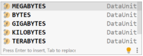
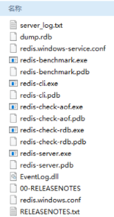

[toc]

# SpringBoot

> 小技巧：（基于idea)
>
> 1. 隐藏文件/类型文件：Setting → File Types → Ignored Files and Folders
> 2. 自动提示内置文件：File → Project Structure → Facets → Spring → 绿叶子按钮 → ＋ → 内置文件

* SpringBoot能够快速创建出生产级别的Spring应用
* 优点：
  \> SpringBoot是整合Spring技术栈的一站式框架
  \> SpringBoot是简化Spring技术栈的快速开发脚手架
* 学习SpringBoot
  官网文档：https://github.com/spring-projects/spring-boot/wiki#release-notes
* Spring VS SpringBoot
  

* maven配置文件设置
  \> 镜像换成国内的aliyun速度会快很多
  \> 设置jdk版本为1.8避免一些不匹配的麻烦

  ~~~xml
  	<mirrors>
        <mirror>
          <id>nexus-aliyun</id>
          <mirrorOf>central</mirrorOf>
          <name>Nexus aliyun</name>
          <url>http://maven.aliyun.com/nexus/content/groups/public</url>
        </mirror>
   	</mirrors>
   
    	<profiles>
           <profile>
                <id>jdk-1.8</id>
                <activation>
                  <activeByDefault>true</activeByDefault>
                  <jdk>1.8</jdk>
                </activation>
                <properties>
                  <maven.compiler.source>1.8</maven.compiler.source>
                  <maven.compiler.target>1.8</maven.compiler.target>
                  <maven.compiler.compilerVersion>1.8</maven.compiler.compilerVersion>
                </properties>
           </profile>
    	</profiles>
  ~~~

* 创建方式：
  \> Spring Initializr + https://start.spring.io（基于idea)
  \> https://start.spring.io + 下载解压 + 导入项目（基于官网）
  \> Spring Initializr + http://start.aliyun.com（基于阿里云）
  \> maven + 手动导入坐标 + 手工制作引导类（基于maven）

## 依赖特性

* parent ：减少依赖冲突【定义了若干个坐标版本号（依赖管理，而非依赖）】

  ~~~xml
  	<parent>
          <groupId>org.springframework.boot</groupId>
          <artifactId>spring-boot-starter-parent</artifactId>
          <version>2.3.4.RELEASE</version>
      </parent>
  ~~~

* starter ：减少依赖配置 【定义了当前项目使用的所有依赖坐标】

  ~~~xml
  	<dependencies>
          <!-- 方式一：springboot中有该依赖 -->
          <dependency>
              <groupId>org.springframework.boot</groupId>
              <artifactId>spring-boot-starter-web</artifactId>
          </dependency>
          
          <!-- 方式二：springboot中有该依赖，但版本号和springboot不同 【properties】-->
          <properties>
              <druid.version>1.1.16</druid.version>
          </properties>
          
          <!-- 方式三：springboot中没有该依赖 【version】-->
          <dependency>
              <groupId>itheima</groupId>
              <artifactId>project-dependencies</artifactId>
              <version>1.1.10</version>
          </dependency>
          
          <!-- 方式四：不要springboot中的该依赖，自己导入所需要的依赖 -->
          <dependency>
              <groupId>org.springframework.boot</groupId>
              <artifactId>spring-boot-starter-web</artifactId>
              <exclusions>
                  <exclusion>
                      <groupId>org.springframework.boot</groupId>
                      <artifactId>spring-boot-starter-tomcat</artifactId>
                  </exclusion>
              </exclusions>
          </dependency>
          <dependency>
              <groupId>org.springframework.boot</groupId>
              <artifactId>spring-boot-starter-jetty</artifactId>
          </dependency>
          
      </dependencies>
  ~~~

* 引导类：启动SpringBoot项目【运行后初始化Spring容器，扫描引导类所在包加载bean】

  ~~~java
  @SpringBootApplication
  public class MainApplication {
      public static void main(String[] args) {
          SpringApplication.run(MainApplication.class,args);
      }
  }
  ~~~

## 内置属性

* 官网：https://docs.spring.io/spring-boot/docs/current/reference/html/application-properties.html#application-properties

* 配置文件类型：

  | 文件类型                | 格式                     |
  | ----------------------- | ------------------------ |
  | application.properties  | server.port=80           |
  | application.yml（主流） | server:<br/>    port: 81 |
  | application.yaml        | server:<br/>    port: 81 |

  优先级：application.properties > application.yml > application.yaml
  不同配置文件中相同配置按照加载优先级相互覆盖，不同配置文件中不同配置全部保留

### yml语法
\> 大小写敏感
\> 缩进表示层级关系，**同层级左侧对齐**，只允许使用空格
\> 属性名与属性值之间使用**冒号+空格**作为分隔
\> # 表示注释

* 字面值

  ~~~yaml
  boolean: TRUE #TRUE,true,True,FALSE,false ， False 均可
  float: 6.8523015e+5 # 支持科学计数法
  int: 0b1010 # 支持二进制、八进制、十六进制
  null: ~ # 使用 ~ 表示 null
  string: HelloWorld # 字符串可以直接书写
  string2: "Hello World" # 可以使用双引号包裹特殊字符
  date: 2018-02-17 # 日期必须使用 yyyy-MM-dd 格式
  datetime: 2018-02-17T15:02:31+08:00 # 时间和日期之间使用 T 连接，最后使用 + 代表时区
  ~~~

* 数组：数据之间用 **减号+空格** 分开

  ~~~yaml
  likes: [王者荣耀,刺激战场] # 数组书写缩略格式
  users2: [ { name:Tom , age:4 } , { name:Jerry , age:5 } ] # 对象数组缩略格式
  users: # 对象数组格式
      - name: Tom
        age: 4
      - name: Jerry
        age: 5
  users: # 对象数组格式二
  	-
        name: Tom
        age: 4
  	-
        name: Jerry
        age: 5 
  ~~~

* 数据读取：
  方式一：读取一个属性

  ~~~yaml
  @Value("${一级属性名.二级属性名……}") # yml文件外
  ${一级属性名.二级属性名……} # yml文件内
  ~~~

  方式二：读取所有属性

  ~~~java
  @Autowired
  private Environment env;
  ~~~

  方式三：读取一个对象

  ~~~java
  @ConfigurationProperties(prefix = "enterprise") 
  public class Enterprise {
      private String name;
      private Integer age;
      private String[] subject;
  }
  ~~~

## 程序的打包与运行

* 程序打包：SpringBoot程序是基于Maven创建的，在Maven中提供有打包的指令，叫做package

  ~~~java
  mvn package
  ~~~

  打包后会产生一个与工程名类似的jar文件，其名称是由模块名+版本号+.jar组成的。

* 程序运行：在程序包所在路径下，执行指令。

  ~~~sh
  java -jar 工程包名.jar
  ~~~

  > 如果你的计算机中没有安装java的jdk环境，是无法正确执行上述操作的，因为程序执行使用的是java指令。

* spring-boot-maven-plugin 插件用于将当前程序打包成一个可以独立运行的程序包

  \> 在使用向导创建SpringBoot工程时，pom.xml文件中会有如下配置，这一段配置千万不能删除，否则打包后无法正常执行程序。这组配置决定了打包出来的程序包是否可以执行。

  ~~~xml
  <build>
   <plugins>
       <plugin>
           <groupId>org.springframework.boot</groupId>
           <artifactId>spring-boot-maven-plugin</artifactId>
       </plugin>
   </plugins>
  </build>
  ~~~

* 端口占用的问题

  ~~~sh
  # 查询端口
  netstat -ano
  # 查询指定端口
  netstat -ano |findstr "端口号"
  # 根据进程PID查询进程名称
  tasklist |findstr "进程PID号"
  # 根据PID杀死任务
  taskkill /F /PID "进程PID号"
  # 根据进程名称杀死任务
  taskkill -f -t -im "进程名称"
  ~~~

* 临时属性
  SpringBoot提供了灵活的配置方式，如果你发现你的项目中有个别属性需要重新配置，可以使用临时属性的方式快速修改某些配置。
  1）使用jar命令启动SpringBoot工程时可以使用临时属性替换配置文件中的属性
  2）java –jar 工程名.jar –-属性名=值
  3）多个临时属性之间使用空格分隔
  4）临时属性必须是当前boot工程支持的属性，否则设置无效

  ~~~sh
  java –jar springboot.jar –-server.port=80 --logging.level.root=debug
  ~~~

## 配置文件

* @ConfigurationProperties（自定义bean）

  > 为bean绑定属性，加载对应bean的时候就可以直接加载配置属性值

  1. 在yml配置文件中以对象的格式添加若干属性

     ~~~yaml
     servers:
       ip-address: 192.168.0.1 
       port: 2345
       timeout: -1
     ~~~

  2. 开发一个用来封装数据的实体类，注意要提供属性对应的setter方法

     ~~~java
     @Component
     @Data
     public class ServerConfig {
         private String ipAddress;
         private int port;
         private long timeout;
     }
     ~~~

  3. 使用@ConfigurationProperties注解就可以将配置中的属性值关联到开发的 模型类上

     ~~~java
     @Component
     @Data
     @ConfigurationProperties(prefix = "servers")
     public class ServerConfig {
         private String ipAddress;
         private int port;
         private long timeout;
     }
     ~~~

* @ConfigurationProperties（第三方bean）

  1. 使用@Bean注解定义第三方bean

     ~~~java
     @Bean
     public DruidDataSource datasource(){
         DruidDataSource ds = new DruidDataSource();
         return ds;
     }
     ~~~

  2. 在yml中定义要绑定的属性，注意datasource此时全小写

     ~~~yaml
     datasource:
       driverClassName: com.mysql.jdbc.Driver
     ~~~

  3. 使用@ConfigurationProperties注解为第三方bean进行属性绑定，注意前缀是全小写的datasource

     ~~~java
     @Bean
     @ConfigurationProperties(prefix = "datasource")
     public DruidDataSource datasource(){
         DruidDataSource ds = new DruidDataSource();
         return ds;
     }
     ~~~

* @EnableConfigurationProperties

  > 当使用@EnableConfigurationProperties注解时，spring会默认将其标注的类定义为bean，因此无需再次声明@Component注解了。

  1. 在配置类上开启@EnableConfigurationProperties注解

     ~~~java
     @SpringBootApplication
     @EnableConfigurationProperties(ServerConfig.class)
     public class Springboot13ConfigurationApplication {
     }
     ~~~

  2. 在对应的类上直接使用@ConfigurationProperties进行属性绑定

     ~~~java
     @Data
     @ConfigurationProperties(prefix = "servers")
     public class ServerConfig {
         private String ipAddress;
         private int port;
         private long timeout;
     }
     ~~~

  3. 解决：用@ConfigurationProperties注解时，会出现一个提示信息
     

     ~~~xml
     <!-- 解决： -->
     <dependency>
         <groupId>org.springframework.boot</groupId>
         <artifactId>spring-boot-configuration-processor</artifactId>
     </dependency>
     ~~~

* 宽松绑定：@ConfigurationProperties绑定属性时支持属性名宽松绑定，配置文件中的命名格式与变量名的命名格式可以进行格式上的最大化兼容

  ~~~yaml
  servers:
    ipAddress: 192.168.0.2       # 驼峰模式
    ip_address: 192.168.0.2      # 下划线模式
    ip-address: 192.168.0.2      # 烤肉串模式
    IP_ADDRESS: 192.168.0.2      # 常量模式
  ~~~

  ~~~java
  @Component
  @Data
  @ConfigurationProperties(prefix = "servers")
  public class ServerConfig {
      private String ipAddress;
  }
  ~~~

  以上4种模式最终都可以匹配到ipAddress这个属性名

  > \> 在进行匹配时，配置中的名称要去掉中划线和下划线后，忽略大小写的情况下去与java代码中的属性名进行忽略大小写的等值匹配
  >
  > \> springboot官方推荐使用烤肉串模式，也就是中划线模式
  >
  > \> 绑定前缀名时，这个词不是随意支持的，必须使用规范的名称烤肉串模式
  >
  > \> 以上规则仅针对springboot中@ConfigurationProperties注解进行属性绑定时有效，对@Value注解进行属性映射无效。

* timeout：服务器操作超时时间，当前值是-1表示永不超时。

  ~~~yaml
  servers:
    ip-address: 192.168.0.1 
    port: 2345
    timeout: -1
  ~~~

  ~~~java
  @Component
  @Data
  @ConfigurationProperties(prefix = "servers")
  public class ServerConfig {
      @DurationUnit(ChronoUnit.HOURS)
      private Duration serverTimeOut; // 设置超时时间单位
      @DataSizeUnit(DataUnit.MEGABYTES)
      private DataSize dataSize; // 设置超空间单位 
  }
  ~~~

  > **Duration**：表示时间间隔，可以通过@DurationUnit注解描述时间单位，例如上例中描述的单位为小时（ChronoUnit.HOURS）
  > 
  >
  > **DataSize**：表示存储空间，可以通过@DataSizeUnit注解描述存储空间单位，例如上例中描述的单位为MB（DataUnit.MEGABYTES）
  > 

* 数据校验

  > 设置数据格式校验，就可以有效避免非法数据加载

  1. 开启校验框架

     ~~~xml
     <!--1.导入JSR303规范-->
     <dependency>
         <groupId>javax.validation</groupId>
         <artifactId>validation-api</artifactId>
     </dependency>
     <!--使用hibernate框架提供的校验器做实现-->
     <dependency>
         <groupId>org.hibernate.validator</groupId>
         <artifactId>hibernate-validator</artifactId>
     </dependency>
     ~~~

  2. 在需要开启校验功能的类上使用注解@Validated开启校验功能

     ~~~java
     @Component
     @Data
     @ConfigurationProperties(prefix = "servers")
     //开启对当前bean的属性注入校验
     @Validated
     public class ServerConfig {
     }
     ~~~

  3. 对具体的字段设置校验规则

     ~~~java
     @Component
     @Data
     @ConfigurationProperties(prefix = "servers")
     //开启对当前bean的属性注入校验
     @Validated
     public class ServerConfig {
         //设置具体的规则
         @Max(value = 8888,message = "最大值不能超过8888")
         @Min(value = 202,message = "最小值不能低于202")
         private int port;
     }
     ~~~

* 数据类型转换

  yaml文件中对于数字的定义支持进制书写格式，如需使用字符串请使用引号明确标注

  注意：
  	1）字符串标准书写加上引号包裹，养成习惯
  	2）遇到0开头的数据多注意，springboot支持二进制，八进制，十六进制

## 测试

* 临时属性

  > @SpringBootTest的properties属性就可以为当前测试用例添加临时的属性，覆盖源码配置文件中对应的属性值进行测试

  ~~~java
  //properties属性可以为当前测试用例添加临时的属性配置
  @SpringBootTest(properties = {"test.prop=testValue1"})
  public class PropertiesAndArgsTest {
  
      @Value("${test.prop}")
      private String msg;
      
      @Test
      void testProperties(){
          System.out.println(msg);
      }
  }
  ~~~

* 临时参数

  > args属性配置优先于properties属性配置加载

  ~~~java
  //args属性可以为当前测试用例添加临时的命令行参数
  @SpringBootTest(args={"--test.prop=testValue2"})
  public class PropertiesAndArgsTest {
      
      @Value("${test.prop}")
      private String msg;
      
      @Test
      void testProperties(){
          System.out.println(msg);
      }
  }
  ~~~

* 测试专用配置

  > 启动测试环境时，生效此配置就行

  1. 在测试包test中创建专用的测试环境配置类

     ~~~java
     @Configuration
     public class MsgConfig {
         @Bean
         public String msg(){
             return "bean msg";
         }
     }
     ~~~

  2. 在启动测试环境时，导入测试环境专用的配置类，使用@Import注解即可实现数据层测试回滚

  > 只要注解@Transactional出现的位置存在注解@SpringBootTest，springboot就会认为这是一个测试程序，无需提交事务，所以也就可以避免事务的提交。
  >
  > 如果想提交事务也可以，再添加一个@RollBack的注解，设置回滚状态为false即可正常提交事务

  ~~~java
  @SpringBootTest
  @Transactional
  @Rollback(true)
  public class DaoTest {
      @Autowired
      private BookService bookService;
  
      @Test
      void testSave(){
          Book book = new Book();
          book.setName("springboot3");
          book.setType("springboot3");
          book.setDescription("springboot3");
  
          bookService.save(book);
      }
  }
  ~~~

* 测试用例数据设定

  > springboot提供了在配置中使用随机值的机制，确保每次运行程序加载的数据都是随机的，数据的加载按照之前加载数据的形式，使用@ConfigurationProperties注解即可

  ~~~java
  @Component
  @Data
  @ConfigurationProperties(prefix = "testcase.book")
  public class BookCase {
      private int id;
      private int id2;
      private int type;
      private String name;
      private String uuid;
      private long publishTime;
  }
  ~~~

  ~~~yaml
  testcase:
    book:
      id: ${random.int} # 表示随机整数
      id2: ${random.int(10)} # 表示10以内的随机数
      type: ${random.int!5,10!} # 表示5到10的随机数，其中()可以是任意字符，例如[]，!!均可
      name: ${random.value} # 随机字符串，MD5字符串，32位
      uuid: ${random.uuid} # 随机uuid
      publishTime: ${random.long} # 随机long整数
  ~~~

## 整合第三方技术

* JUnit：测试类在SpringBoot启动类的包或子包外，启动类扫描不到，需要手动添加启动类的设置

  ~~~java
  // classes：设置SpringBoot启动类
  @SpringBootTest(classes = Springboot05JUnitApplication.class)
  class Springboot07JUnitApplicationTests {}
  ~~~

* mybatis

  1. 选择当前模块需要使用的技术集（MyBatis、MySQL）

  2. 设置数据源参数

     ~~~yaml
     spring: # 自动提示
         datasource:  
             driver-class-name: com.mysql.cj.jdbc.Driver
             url: jdbc:mysql://localhost:3306/ssm_db
             username: root
             password: root
     ~~~

     SpringBoot版本低于2.4.3(不含)，Mysql驱动版本大于8.0时，需要在url连接串中配置时区
     `serverTimezone=UTC`

  3. 定义接口和映射配置

  4. 注入接口，测试功能

* Druid

  1. 导入Druid对应的starter

     ~~~xml
     <dependency>
         <groupId>com.alibaba</groupId>
         <artifactId>druid-spring-boot-starter</artifactId>
         <version>1.2.6</version>
     </dependency>
     ~~~

  2. 设置数据源参数

     ~~~yaml
     spring:
         datasource:
             driver-class-name: com.mysql.cj.jdbc.Driver
             url: jdbc:mysql://localhost:3306/ssm_db?serverTimezone=UTC
             username: root
             password: root
             type: com.alibaba.druid.pool.DruidDataSource
             
     # 方式二:
     spring:
         datasource:
             druid:
                 driver-class-name: com.mysql.cj.jdbc.Driver
                 url: jdbc:mysql://localhost:3306/ssm_db?serverTimezone=UTC
                 username: root
                 password: root
     ~~~

* 任意第三方技术

  1. 导入对应的starter
  2. 配置对应的设置或采用默认配置

### Redis缓存

* Redis是一款采用key-value数据存储格式的内存级NoSQL数据库
* Redis自身并不是为了数据持久化而生的，主要是在内存中保存数据，加速数据访问的，所以说是一款内存级数据库

#### 安装【windows】

* 安装包下载地址：https://github.com/tporadowski/redis/releases【msi】

* 一键安装的msi文件：一站式服务，安装过程一条龙操作一气呵成，就是为小白用户提供的软件安装程序

* 安装完毕后会得到如下文件，其中有两个文件对应两个命令，是启动Redis的核心命令，需要再CMD命令行模式执行。

  > 启动服务器：redis-server.exe redis.windows.conf
  > \> 初学者无需调整服务器对外服务端口，默认6379。
  > \> 如果启动redis服务器失败，可以先启动客户端，然后执行shutdown操作后退出，此时redis服务器就可以正常执行了
  >
  > 启动客户端：redis-cli.exe

* 基本操作

  ~~~sh
  # 添加
  set name itheima # 为数据itheima定义一个名称name
  
  # 查找
  get name # 根据名称name取，就可以得到对应数据
  
  # hash结构：它是一种一个名称下可以存储多个数据的存储模型，并且每个数据也可以有自己的二级存储名称
  
  # 添加
  hset a a1 aa1 # 对外key名称是a，在名称为a的存储模型中，a1这个key中保存了数据aa1
  hset a a2 aa2
  # 查找
  hget a a1 #得到aa1
  hget a a2 #得到aa2
  ~~~

#### 整合Springboot

1. 依赖

   ~~~xml
   <dependen cy>
       <groupId>org.springframework.boot</groupId>
       <artifactId>spring-boot-starter-data-redis</artifactId>
   </dependency>
   ~~~

2. 基础配置

   ~~~yaml
   spring:
     redis:
       host: localhost
       port: 6379
     cache:
       type: redis
       redis:
         use-key-prefix: false
         key-prefix: sms_
         cache-null-values: false
         time-to-live: 10s
   ~~~

3. 专用客户端接口操作，此处使用的是RedisTemplate【代码方式】（了解，可忽略）

   ~~~java
   @SpringBootTest
   class Springboot16RedisApplicationTests {
       @Autowired
       private RedisTemplate redisTemplate;
       
       @Test
       void set() {
           // 获取string类型 opsForValue();
           ValueOperations ops = redisTemplate.opsForValue(); 
           ops.set("age",41);
       }
       @Test
       void get() {
           ValueOperations ops = redisTemplate.opsForValue();
           Object age = ops.get("name");
           System.out.println(age);
       }
       @Test
       void hset() {
           HashOperations ops = redisTemplate.opsForHash();
           ops.put("info","b","bb");
       }
       @Test
       void hget() {
           HashOperations ops = redisTemplate.opsForHash();
           Object val = ops.get("info", "b");
           System.out.println(val);
       }
   }
   ~~~

   优化：StringRedisTemplate

   > \> 由于redis内部不提供java对象的存储格式，因此当操作的数据以对象的形式存在时，会进行转码，转换成字符串格式后进行操作。
   >
   > \> 可以理解为这是RedisTemplate的一种指定数据泛型的操作API。

   ~~~java
   @SpringBootTest
   public class StringRedisTemplateTest {
       @Autowired
       private StringRedisTemplate stringRedisTemplate;
       @Test
       void get(){
           ValueOperations<String, String> ops = stringRedisTemplate.opsForValue();
           String name = ops.get("name");
           System.out.println(name);
       }
   }
   ~~~

4. 启用缓存，在引导类上方标注注解@EnableCaching配置springboot程序中可以使用缓存【注解方式】

   ~~~java
   @SpringBootApplication
   //开启缓存功能
   @EnableCaching
   public class Springboot19CacheApplication {
       public static void main(String[] args) {
           SpringApplication.run(Springboot19CacheApplication.class, args);
       }
   }
   ~~~

   设置操作的数据是否使用缓存

   ~~~java
   @Service
   public class BookServiceImpl implements BookService {
       @Autowired
       private BookDao bookDao;
   
       @Cacheable(value="cacheSpace",key="#id")
       public Book getById(Integer id) {
           return bookDao.selectById(id);
       }
       //在业务方法上面使用注解@Cacheable声明当前方法的返回值放入缓存中，其中要指定缓存的存储位置，以及缓存中保存当前方法返回值对应的名称。上例中value属性描述缓存的存储位置，可以理解为是一个存储空间名，key属性描述了缓存中保存数据的名称，使用#id读取形参中的id值作为缓存名称。
       //使用@Cacheable注解后，执行当前操作，如果发现对应名称在缓存中没有数据，就正常读取数据，然后放入缓存；如果对应名称在缓存中有数据，就终止当前业务方法执行，直接返回缓存中的数据。
   }
   ~~~

   

5. 切换redis客户端实现技术【根据需要】

   > 默认提供的是lettucs客户端技术

   ~~~xml
   <dependency>
       <groupId>redis.clients</groupId>
       <artifactId>jedis</artifactId>
   </dependency>
   ~~~

   ~~~yaml
   spring:
     redis:
       host: localhost
       port: 6379
       client-type: jedis
       lettuce:
         pool:
           max-active: 16
       jedis:
         pool:
           max-active: 16
   ~~~

   **lettcus与jedis区别**
   \> jedis连接Redis服务器是直连模式，当多线程模式下使用jedis会存在线程安全问题，解决方案可以通过配置连接池使每个连接专用，这样整体性能就大受影响
   \> lettcus基于Netty框架进行与Redis服务器连接，底层设计中采用StatefulRedisConnection。 StatefulRedisConnection自身是线程安全的，可以保障并发访问安全问题，所以一个连接可以被多线程复用。当然lettcus也支持多连接实例一起工作

### 任务

* 任务系统，其实这里说的任务系统指的是定时任务。

* Task

  1. 开启定时任务功能

     ~~~java
     @SpringBootApplication
     //开启定时任务功能
     @EnableScheduling
     public class Springboot22TaskApplication {
         public static void main(String[] args) {
             SpringApplication.run(Springboot22TaskApplication.class, args);
         }
     }
     ~~~

  2. 定义Bean，在对应要定时执行的操作上方，使用注解@Scheduled定义执行的时间，执行时间的描述方式还是cron表达式

     ~~~java
     @Component
     public class MyBean {
         @Scheduled(cron = "0/1 * * * * ?")
         public void print(){
             System.out.println(Thread.currentThread().getName()+" :spring task run...");
         }
     }
     ~~~

  3. 对定时任务进行相关配置

     ~~~yaml
     spring:
       task:
        	scheduling:
           pool:
            	size: 1							# 任务调度线程池大小 默认 1
           thread-name-prefix: ssm_      	# 调度线程名称前缀 默认 scheduling-      
             shutdown:
               await-termination: false		# 线程池关闭时等待所有任务完成
               await-termination-period: 10s	# 调度线程关闭前最大等待时间，确保最后一定关闭
     ~~~

### 邮件

* SMTP（Simple Mail Transfer Protocol）：简单邮件传输协议，用于**发送**电子邮件的传输协议
* POP3（Post Office Protocol - Version 3）：用于**接收**电子邮件的标准协议
* IMAP（Internet Mail Access Protocol）：互联网消息协议，是POP3的替代协议

#### 发送邮件

1. 导入springboot整合javamail的starter

   ```xml
   <dependency>
       <groupId>org.springframework.boot</groupId>
       <artifactId>spring-boot-starter-mail</artifactId>
   </dependency>
   ```

2. 配置邮箱的登录信息

   ~~~yaml
   spring:
     mail:
       host: smtp.126.com # 提供邮件服务的主机协议，当前程序仅用于发送邮件，因此配置的是smtp的协议。
       username: test@126.com
       password: test # 不是邮箱账号的登录密码，是邮件供应商提供的一个加密后的密码
       # 可以到邮件供应商的设置页面找POP3或IMAP这些关键词找到对应的获取位置。
   ~~~

3. 使用JavaMailSender接口发送邮件【简单邮件】

   ~~~java
   @Service
   public class SendMailServiceImpl implements SendMailService {
       @Autowired
       private JavaMailSender javaMailSender;
   
       //发送人
       private String from = "test@qq.com";
       //接收人
       private String to = "test@126.com";
       //标题
       private String subject = "测试邮件";
       //正文
       private String context = "测试邮件正文内容";
   
       @Override
       public void sendMail() {
           // 将发送邮件的必要信息（发件人、收件人、标题、正文）封装到SimpleMailMessage对象中，可以根据规则设置发送人昵称等。
           SimpleMailMessage message = new SimpleMailMessage();
           
           message.setFrom(from+"(小甜甜)");
           message.setTo(to);
           message.setSubject(subject);
           message.setText(context);
           
           javaMailSender.send(message);
       }
   }
   ~~~

4. 使用MimeMessage可以发送特殊的邮件。【复杂邮件】

   ~~~java
   @Service
   public class SendMailServiceImpl2 implements SendMailService {
       @Autowired
       private JavaMailSender javaMailSender;
   
       //发送人
       private String from = "test@qq.com";
       //接收人
       private String to = "test@126.com";
       //标题
       private String subject = "测试邮件";
       //正文
       private String context = "<a href='https://www.itcast.cn'>点开有惊喜</a>";
   
       public void sendMail() {
           try {
               MimeMessage message = javaMailSender.createMimeMessage();
               //不支持附件
               // MimeMessageHelper helper = new MimeMessageHelper(message);
               //支持附件
               MimeMessageHelper helper = new MimeMessageHelper(message,true);		
               
               helper.setFrom(to+"(小甜甜)");
               helper.setTo(from);
               helper.setSubject(subject);
               // 发送网页正文邮件
               helper.setText(context,true);		
               // 添加附件
               File f1 = new File("springboot_23_mail-0.0.1-SNAPSHOT.jar");
               File f2 = new File("resources\\logo.png");
               helper.addAttachment(f1.getName(),f1); 
               helper.addAttachment("最靠谱的培训结构.png",f2);  //带后缀可以预览图片
               
               javaMailSender.send(message);
           } catch (Exception e) {
               e.printStackTrace();
           }
       }
   }
   ~~~


