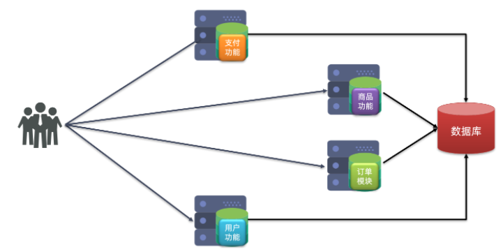
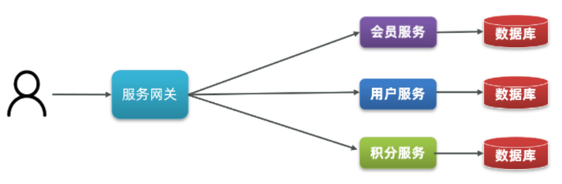
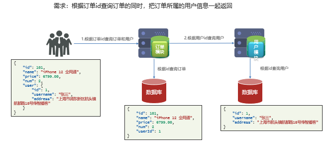
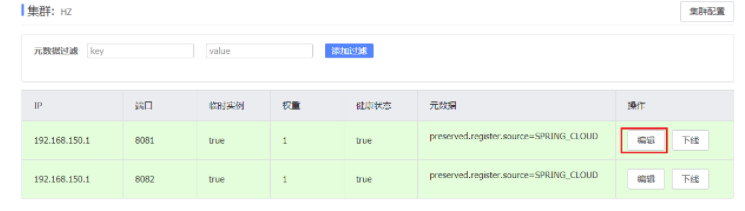
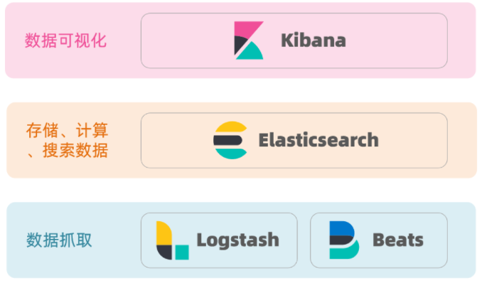

[toc]

# 微服务框架

## 微服务概念

* 单体架构
  \> 定义：将业务的所有功能集中在一个项目中开发，打成一个包部署
  \> 优点：架构简单、部署成本低
  \> 缺点：耦合度高（维护困难、升级困难）
  
* 分布式架构
  \> 定义：根据业务功能对系统做拆分，每个业务功能模块作为独立项目开发，称为一个服务
  \> 优点：降低服务耦合、有利于服务升级和拓展
  \> 缺点：服务调用关系错综复杂
  
* 微服务
  \> 定义：给分布式架构制定一个标准，进一步降低服务之间的耦合度，提供服务的独立性和灵活性。做到高内聚，低耦合。
  \> 特征：单一职责、自治、面向服务、隔离性强
  
* SpringCloud
  \> 定义：微服务架构的一站式解决方案，集成了各种优秀微服务功能组件
  \> 官网地址：https://spring.io/projects/spring-cloud
  \> 注意：SpringCloud底层是依赖于SpringBoot的，并且有版本的兼容关系

## SpringCloud（架构）

### 服务拆分和远程调用

* 服务拆分原则
  \> 不同微服务，不要重复开发相同业务
  \> 微服务数据独立，不要访问其它微服务的数据库
  \> 微服务可以将自己的业务暴露为接口，供其它微服务调用

* 远程调用方式
  \> 基于RestTemplate发起的http请求实现远程调用
  \> http请求做远程调用是与语言无关的调用，只要知道对方的ip、端口、接口路径、请求参数即可。

* 远程调用角色
  \> 服务提供者：一次业务中，被其它微服务调用的服务。（提供接口给其它微服务）
  \> 服务消费者：一次业务中，调用其它微服务的服务。（调用其它微服务提供的接口）
  

* 示例
  

  1. 项目结构：

     * cloud-demo：父工程，管理依赖

       - order-service：订单微服务，负责订单相关业务

       - user-service：用户微服务，负责用户相关业务

     \> 订单微服务和用户微服务都必须有各自的数据库，相互独立
     \> 订单服务和用户服务都对外暴露Restful的接口
     \> 订单服务如果需要查询用户信息，只能调用用户服务的Restful接口，不能查询用户数据库

  2. 创建数据库、部署环境、搭建项目

  3. 在**消费者**中注册RestTemplate（Bean)

     ~~~java
     @MapperScan("cn.itcast.order.mapper")
     @SpringBootApplication
     public class OrderApplication {    
         public static void main(String[] args) {        
             SpringApplication.run(OrderApplication.class, args);    
         }   
         
         @Bean    
         public RestTemplate restTemplate(){
             return new RestTemplate();    
         }
     }
     ~~~

  4.   **消费者**服务远程调用RestTemplate（service）

     ~~~java
     @Service
     public class OrderService {
         @Autowired
         private RestTemplate restTemplate;
         public Order queryOrderById(Long orderId) {
             // 1.查询订单
             Order order = orderMapper.findById(orderId);
             // TODO 2.查询用户
             String url = "http://localhost:8081/user/" +  order.getUserId();
             User user = restTemplate.getForObject(url, User.class);
             // 3.封装user信息
             order.setUser(user);
             // 4.返回
             return order;
         }
     }
     ~~~

### Eureka注册中心

* Eureka存在的意义和作用
  * 消费者获取服务提供者具体信息
    \> 服务提供者启动时向eureka注册自己的信息
    \> eureka保存这些信息
    \> 消费者根据服务名称向eureka拉取提供者信息
  * 如果有多个服务提供者，消费者可选择
    \> 服务消费者利用负载均衡算法，从服务列表中挑选一个
  * 消费者可感知服务提供者健康状态
    \> 服务提供者会每隔30秒向EurekaServer发送心跳请求，报告健康状态
    \> eureka会更新记录服务列表信息，心跳不正常会被剔除
    \> 消费者就可以拉取到最新的信息

* Eureka架构中的角色

  * EurekaServer：服务端，注册中心
    \> 记录服务信息
    \> 心跳监控
  * EurekaClient：客户端
    * Provider：服务提供者，例如案例中的 user-service
      	\> 注册自己的信息到EurekaServer
      	\> 每隔30秒向EurekaServer发送心跳
    * consumer：服务消费者，例如案例中的 order-service
      	\> 根据服务名称从EurekaServer拉取服务列表
      	\> 基于服务列表做负载均衡，选中一个微服务后发起远程调用

  

* 搭建eureka

  - eurekaserver服务端

    1. 引入依赖

       ~~~xml
       <dependency>
           <groupId>org.springframework.cloud</groupId>
           <artifactId>spring-cloud-starter-netflix-eureka-server</artifactId>
       </dependency>
       ~~~

    2. 启动类添加@EnableEurekaServer注解，开启eureka的注册中心功能

       ~~~java
       @SpringBootApplication
       @EnableEurekaServer
       public class EurekaApplication {
           public static void main(String[] args) {
               SpringApplication.run(EurekaApplication.class, args);
           }
       }
       ~~~

    3. 在application.yml中配置eureka地址

       ~~~yaml
       server:
         port: 10086 # 服务器端口
       spring:
         application:
           name: eureka-server # 服务器名称
       eureka:
         client:
           service-url: 
             defaultZone: http://127.0.0.1:10086/eureka # 注册中心服务端地址
       ~~~

    4. 启动服务，访问浏览器验证：http://127.0.0.1:10086（上面的注册中心服务端地址）

  - eurekaclient客户端

    - provider 服务提供者**（服务注册）**

      1. 引入依赖

         ~~~xml
         <dependency>
             <groupId>org.springframework.cloud</groupId>
             <artifactId>spring-cloud-starter-netflix-eureka-client</artifactId>
         </dependency>
         ~~~

      2. 配置文件

         ~~~yaml
         server:
           port: 8081 # 服务器端口
         spring:
           application:
             name: userservice # 服务器名称
         eureka:
           client:
             service-url:
               defaultZone: http://127.0.0.1:10086/eureka # 注册中心服务端地址
         ~~~

    - consumer 服务消费者**（服务发现）**

      1. 引入依赖

         ~~~xml
         <dependency>
             <groupId>org.springframework.cloud</groupId>
             <artifactId>spring-cloud-starter-netflix-eureka-client</artifactId>
         </dependency>
         ~~~

      2. 配置文件

         ~~~yaml
         server:
           port: 8081 # 服务器端口
         spring:
           application:
             name: orderservice
         eureka:
           client:
             service-url:
               defaultZone: http://127.0.0.1:10086/eureka
         ~~~

      3. 实现负载均衡

         ~~~java
         @Bean
         @LoadBalanced //给RestTemplate这个Bean添加一个@LoadBalanced注解
         public RestTemplate restTemplate() {
             return new RestTemplate();
         }
         ~~~

      4. 服务拉取（service）

         ~~~java
         @Service
         public class OrderService {
             @Autowired
             private RestTemplate restTemplate;
             public Order queryOrderById(Long orderId) {
                 // 1.查询订单
                 Order order = orderMapper.findById(orderId);
                 
                 // TODO 2.查询用户
            		/* 
            		String url = "http://localhost:8081/user/" +  order.getUserId(); 
                 改：用服务名代替ip、端口 
                 */
         		String url = "http://userservice/user/" + order.getUserId();
                 
                 User user = restTemplate.getForObject(url, User.class);
                 // 3.封装user信息
                 order.setUser(user);
                 // 4.返回
                 return order;
             }
         }
         ~~~

      

### 负载均衡

探究：请求是http://userservice/user/1，怎么变成了http://localhost:8081

* 添加实例步骤：
  


* 原理：SpringCloud底层其实是利用了一个名为Ribbon的组件，来实现负载均衡功能的。

  

* 负载均衡策略：负载均衡规则是一个叫做**IRule**的接口来定义的，每一个子接口都是一种规则
  

  | **内置负载均衡规则类**    | **规则描述**                                                 |
  | ------------------------- | ------------------------------------------------------------ |
  | RoundRobinRule            | 简单轮询服务列表来选择服务器。它是Ribbon默认的负载均衡规则。 |
  | AvailabilityFilteringRule | 对以下两种服务器进行忽略：   （1）在默认情况下，这台服务器如果3次连接失败，这台服务器就会被设置为“短路”状态。短路状态将持续30秒，如果再次连接失败，短路的持续时间就会几何级地增加。  （2）并发数过高的服务器。如果一个服务器的并发连接数过高，配置了AvailabilityFilteringRule规则的客户端也会将其忽略。并发连接数的上限，可以由客户端的<clientName>.<clientConfigNameSpace>.ActiveConnectionsLimit属性进行配置。 |
  | WeightedResponseTimeRule  | 为每一个服务器赋予一个权重值。服务器响应时间越长，这个服务器的权重就越小。这个规则会随机选择服务器，这个权重值会影响服务器的选择。 |
  | ZoneAvoidanceRule         | （默认）  以区域可用的服务器为基础进行服务器的选择。使用Zone对服务器进行分类，这个Zone可以理解为一个机房、一个机架等。而后再对Zone内的多个服务做轮询。 |
  | BestAvailableRule         | 忽略那些短路的服务器，并选择并发数较低的服务器。             |
  | RandomRule                | 随机选择一个可用的服务器。                                   |
  | RetryRule                 | 重试机制的选择逻辑                                           |

  * 自定义负载均衡策略
    \> 方式一：代码（该消费者给所需的提供者**都**设置为该规则）

    ~~~java
    @Bean
    public IRule randomRule(){
        return new RandomRule();
    }
    ~~~

    \> 方式二：配置文件（该消费者给**特定**的提供者设置规则）

    ~~~yaml
    userservice: # 给某个微服务配置负载均衡规则，这里是userservice服务
      ribbon:
        NFLoadBalancerRuleClassName: com.netflix.loadbalancer.RandomRule # 负载均衡规则 
    ~~~

  * 负载均衡饥饿加载
    \> Ribbon默认是采用懒加载，即第一次访问时才会去创建LoadBalanceClient，请求时间会很长。
    \> 饥饿加载则会在项目启动时创建，降低第一次访问的耗时

    ~~~yaml
    ribbon:
      eager-load:
        enabled: true # 开启饥饿加载
        clients: userservice # 指定对userservice这个服务饥饿加载
    ~~~

### Nacos注册中心

* [Nacos](https://nacos.io/)是阿里巴巴的产品，现在是[SpringCloud](https://spring.io/projects/spring-cloud)中的一个组件。相比[Eureka](https://github.com/Netflix/eureka)功能更加丰富，在国内受欢迎程度较高

* 安装：【软件安装指南文件夹】（安装好后即完成注册中心服务端的创建）

* Nacos的服务实例分为两种l类型：
  \> 临时实例：如果实例宕机超过一定时间，会从服务列表剔除，默认的类型。
  \> 非临时实例：如果实例宕机，不会从服务列表剔除，也可以叫永久实例。

  ~~~yaml
  spring:
    cloud:
      nacos:
        discovery:
          ephemeral: false # 设置为非临时实例
  ~~~

* Nacos与eureka的共同点

  - 都支持服务注册和服务拉取
  - 都支持服务提供者心跳方式做健康检测

* Nacos与Eureka的区别

  - Nacos支持服务端主动检测提供者状态：临时实例采用心跳模式，非临时实例采用主动检测模式
  - 临时实例心跳不正常会被剔除，非临时实例则不会被剔除
  - Nacos支持服务列表变更的消息推送模式，服务列表更新更及时
  - Nacos集群默认采用AP方式，当集群中存在非临时实例时，采用CP模式；Eureka采用AP方式

#### 服务注册到nacos（客户端）

1. 引入依赖

   ~~~xml
   <!-- 父工程的pom文件中的`<dependencyManagement>`中引入SpringCloudAlibaba的依赖 -->
   <dependency>
       <groupId>com.alibaba.cloud</groupId>
       <artifactId>spring-cloud-alibaba-dependencies</artifactId>
       <version>2.2.6.RELEASE</version>
       <type>pom</type>
       <scope>import</scope>
   </dependency>
   ~~~

   ~~~xml
   <!-- 消费者和提供者中的pom文件中引入nacos-discovery依赖 -->
   <dependency>
       <groupId>com.alibaba.cloud</groupId>
       <artifactId>spring-cloud-starter-alibaba-nacos-discovery</artifactId>
   </dependency>
   ~~~

2. 配置文件

   ~~~yaml
   spring:
     cloud:
       nacos:
         server-addr: localhost:8848 # 消费者和提供者的application.yml中添加nacos地址，地址在安装Nacos的时候已经确定
   ~~~

3. 重启微服务，即可在nacos管理页面看到微服务信息
   

#### 服务分级存储模型

* 一个**服务**可以有多个**实例**，这些实例分布于全国各地的不同机房，Nacos就将同一机房内的实例 划分为一个**集群**。
  \> 127.0.0.1:8081，在上海机房
  \> 127.0.0.1:8082，在上海机房
  \> 127.0.0.1:8083，在杭州机房

  

* 添加集群配置：修改application.yml文件

  ~~~yaml
  spring:
    cloud:
      nacos:
        server-addr: localhost:8848
        discovery:
          cluster-name: HZ # 集群名称
  ~~~

* 增加实例并设置集群

  ~~~sh
  -Dserver.port=8083 -Dspring.cloud.nacos.discovery.cluster-name=SH
  ~~~

  

* 服务跨集群调用：服务调用尽可能选择本地集群的服务，跨集群调用延迟较高。本地集群不可访问时，再去访问其它集群
  

  * 同集群优先的负载均衡
    \> 默认的`ZoneAvoidanceRule`并不能实现根据同集群优先来实现负载均衡。因此Nacos中提供了一个`NacosRule`的实现，可以优先从同集群中挑选实例。

    ~~~yaml
    spring:
      cloud:
        nacos:
          server-addr: localhost:8848
          discovery:
            cluster-name: HZ # 集群名称
            
    userservice:
      ribbon:
        NFLoadBalancerRuleClassName: com.alibaba.cloud.nacos.ribbon.NacosRule # 负载均衡规则 
    ~~~

#### 权重配置

* 默认情况下NacosRule是同集群内随机挑选，不会考虑机器的性能问题。
* Nacos提供了权重配置来控制访问频率，权重越大则访问频率越高。
* 在nacos控制台，找到实例列表，点击编辑，即可修改权重。
* 注意：如果权重修改为0，则该实例永远不会被访问



#### 环境隔离

* nacos中可以有多个namespace，namespace下可以有group、service等，不同namespace之间相互隔离，例如不同namespace的服务互相不可见

* 默认情况下，所有service、data、group都在同一个namespace，名为public。可添加namespace
  

* 给微服务配置namespace

  ~~~yaml
  spring:
    cloud:
      nacos:
        server-addr: localhost:8848
        discovery:
          cluster-name: HZ
          namespace: 492a7d5d-237b-46a1-a99a-fa8e98e4b0f9 # 命名空间，填ID
  ~~~

  

  > 此时访问order-service，因为namespace不同，会导致找不到userservice，控制台会报错

#### 配置管理

##### 统一配置

* 当微服务部署的实例越来越多，达到数十、数百时，逐个修改微服务配置就会很容易出错。Nacos一方面可以将配置集中管理，另一方可以在配置变更时，及时通知微服务，实现配置的热更新
  
  
* 建议：项目的核心配置，需要热更新的配置才有放到nacos管理的必要。基本不会变更的一些配置还是保存在微服务本地比较好。

* 步骤：

  1. 添加配置
     

  2. 从微服务拉取配置
      思路：微服务要拉取nacos中管理的配置，并且与本地的application.yml配置合并，才能完成项目启动。但如果尚未读取application.yml，又如何得知nacos地址呢？因此spring引入了一种新的配置文件：bootstrap.yaml文件，会在application.yml之前被读取。
      

    1）微服务中引入nacos-config客户端依赖

    ```xml
    <!--nacos配置管理依赖-->
    <dependency>
        <groupId>com.alibaba.cloud</groupId>
        <artifactId>spring-cloud-starter-alibaba-nacos-config</artifactId>
    </dependency>
    ```

    2）微服务中添加bootstrap.yaml

    ```yaml
    spring:
      application:
        name: userservice # 服务名称
      profiles:
        active: dev #开发环境，这里是dev 
      cloud:
        nacos:
          server-addr: localhost:8848 # Nacos地址
          config:
            file-extension: yaml # 文件后缀名
    ```

    > 这里会根据spring.cloud.nacos.server-addr获取nacos地址，再根据`${spring.application.name}-${spring.profiles.active}.${spring.cloud.nacos.config.file-extension}`作为文件id，来读取配置。本例中，就是去读取`userservice-dev.yaml`

    3）读取nacos配置

    ~~~java
    @Slf4j
    @RestController
    @RequestMapping("/user")
    public class UserController {
    
        @Autowired
        private UserService userService;
    
        @Value("${pattern.dateformat}") // Nacos管理页面中的配置属性
        private String dateformat;
        
        @GetMapping("now")
        public String now(){
            return LocalDateTime.now().format(DateTimeFormatter.ofPattern(dateformat));
        }
        // ...略
    }
    ~~~

##### 热更新

* 修改nacos中的配置后，微服务中无需重启即可让配置生效

* 实现

  \> 方式一：在@Value注入的变量所在类上添加注解@RefreshScope

  ~~~java
  @Slf4j
  @RestController
  @RequestMapping("/user")
  @RefreshScope // 1.添加注解
  public class UserController {
  	@Value("${pattern.dateformat}") // 2.获取获取配置属性值
      private string dateformat;
  }
  ~~~

  \> 方式二：使用@ConfigurationProperties注解代替@Value注解。

  ~~~java
  @Component
  @Data
  @ConfigurationProperties(prefix = "pattern") // prefix + 属性 = 配置的属性
  public class PatternProperties {
      private String dateformat; // 获取获取配置属性值
  }
  ~~~

  ~~~java
  @Slf4j
  @RestController
  @RequestMapping("/user")
  public class UserController {
  
      @Autowired
      private UserService userService;
  
      @Autowired
      private PatternProperties patternProperties; // 1
  
      @GetMapping("now")
      public String now(){
          return LocalDateTime.now().format(DateTimeFormatter.ofPattern(patternProperties.getDateformat())); // 2
      }
  
      // 略
  }
  ~~~

##### 配置共享

* 微服务启动时，会去nacos读取多个配置文件

  * `[spring.application.name]-[spring.profiles.active].yaml`，例如：userservice-dev.yaml
  * `[spring.application.name].yaml`，例如：userservice.yaml

  而`[spring.application.name].yaml`不包含环境，因此可以被多个环境共享。

* **添加**环境共享配置【同添加配置一样，但 Data ID 格式为`[spring.application.name].yaml`】

* **读取**共享配置【同读取配置一样】

* **设置**不同的环境配置
  

* 配置共享的优先级
  

##### Nacos集群

【参考Nacos集群搭建】

### Feign远程调用

* Feign是一个声明式的http客户端，其作用就是帮助我们优雅的实现http请求的发送

* 官方地址：https://github.com/OpenFeign/feign

* Feign替代RestTemplate

  1. 引入依赖：服务消费者的pom文件中引入feign的依赖：

     ```xml
     <dependency>
         <groupId>org.springframework.cloud</groupId>
         <artifactId>spring-cloud-starter-openfeign</artifactId>
     </dependency>
     ```

  2. 添加注解：启动类添加@EnableFeignClients注解开启Feign的功能

     ~~~java
     @EnableFeignClients // 开启Feign的功能
     @MapperScan("cn.itcast.order.mapper")
     @SpringBootApplication
     public class orderApplication{
     	public static void main(string[] args) {
     		SpringApplication.run(OrderApplication.class, args);
         }
     }
     ~~~

  3. 编写编写FeignClient接口

     ~~~java
     @FeignClient("userservice")
     public interface UserClient {
         @GetMapping("/user/{id}")
         User findById(@PathVariable("id") Long id);
     }
     ~~~

     > 这个客户端主要是基于SpringMVC的注解来声明远程调用的信息
     >
     > - 服务名称：userservice
     > - 请求方式：GET
     > - 请求路径：/user/{id}
     > - 请求参数：Long id
     > - 返回值类型：User

  4. 远程调用：使用FeignClient中定义的方法代替RestTemplate

     ~~~java
     @Autowired
     private UserClient userClient;
     
     public order queryorderbyId(Long orderid){
         // 1.查询订单
         Order order =orderMapper.findById(orderId);
         //2.利用Feign发起http请求，查询用户 ⭐
         User user =userClient.findById(order.getUserId());
         //3.封装
         user到0rder order.setuser(user);
         // 4.返回
         return order;
     }
     ~~~

* Feign最佳使用
  \> 继承方式：定义一个API接口，利用定义方法，并基于SpringMVC注解做声明。Feign客户端和Controller都集成改接口。

  > 优点：简单、实现了代码共享
  >
  > 缺点：
  > \> 服务提供方、服务消费方紧耦合
  > \> 参数列表中的注解映射并不会继承，因此Controller中必须再次声明方法、参数列表、注解

  \> 抽取方式：将Feign的Client抽取为独立模块，并且把接口有关的POJO、默认的Feign配置都放到这个模块中，提供给所有消费者使用。

  * 实现

    1. 创建一个module API接口

    2. 引入feign的starter依赖

    3. 编写的编写有关所有提供者涉及到的feign内容，如：UserClient、User、DefaultFeignConfiguration

    4. 消费者服务的pom文件中中引入API接口的依赖

    5. 指定消费者Feign应该扫描的API接口包：

       ```java
       @EnableFeignClients(basePackages = "cn.itcast.feign.clients")
       ```

       或者：指定需要加载的Client接口：

       ```java
       @EnableFeignClients(clients = {UserClient.class})
       ```

* 自定义配置：如果要自定义时，只需要创建自定义的@Bean覆盖默认Bean即可。

  | 类型                | 作用             | 说明                                                   |
  | ------------------- | ---------------- | ------------------------------------------------------ |
  | feign.Logger.Level  | 修改日志级别     | 包含四种不同的级别：NONE 、BASIC、HEADERS、FULL        |
  | feign.codec.Decoder | 响应结果的解析器 | http远程调用的结果做解析，例如解析json字符串为java对象 |
  | feign.codec.Encoder | 请求参数编码     | 将请求参数编码，便于通过http请求发送                   |
  | feign. Contract     | 支持的注解格式   | 默认是SpringMVC的注解                                  |
  | feign. Retryer      | 失败重试机制     | 请求失败的重试机制，默认是没有，不过会使用Ribbon的重试 |
  
  > feign.Logger.Level：日志级别尽量用basic
  >
  > - NONE：不记录任何日志信息，这是默认值。
  > - BASIC：仅记录请求的方法，URL以及响应状态码和执行时间
  > - HEADERS：在BASIC的基础上，额外记录了请求和响应的头信息
  > - FULL：记录所有请求和响应的明细，包括头信息、请求体、元数据。
  
  * 方式一：配置文件方式
  
    ~~~yaml
    # 针对单个服务
    feign:  
      client:
        config: 
          userservice: # 针对某个微服务的配置
            loggerLevel: FULL #  日志级别 
            
    # 针对所有服务
    feign:  
      client:
        config: 
          default: # 这里用default就是全局配置，如果是写服务名称，则是针对某个微服务的配置
            loggerLevel: FULL #  日志级别 
    ~~~
  
  * 方式二：代码方式
  
    ~~~java
    public class DefaultFeignConfiguration  {
        @Bean
        public Logger.Level feignLogLevel(){
            return Logger.Level.BASIC; // 日志级别为BASIC
        }
    }
    ~~~
  
    * 如果要**全局生效**，将其放到启动类的@EnableFeignClients这个注解中：
  
      ```java
      @EnableFeignClients(defaultConfiguration = DefaultFeignConfiguration .class) 
      ```
  
    * 如果是**局部生效**，则把它放到对应的@FeignClient这个注解中：
  
      ```java
      @FeignClient(value = "userservice", configuration = DefaultFeignConfiguration .class) 
      ```
  
* Feign使用连接池

  \> URLConnection：默认实现，不支持连接池

  \> Apache HttpClient ：支持连接池

  \> OKHttp：支持连接池

  1. 引入依赖：Apache的HttpClient依赖

     ```xml
     <!--httpClient的依赖 -->
     <dependency>
         <groupId>io.github.openfeign</groupId>
         <artifactId>feign-httpclient</artifactId>
     </dependency>
     ```

  2. 配置连接池

     ```yaml
     feign:
       client:
         config:
           default: # default全局的配置
             loggerLevel: BASIC # 日志级别，BASIC就是基本的请求和响应信息
       httpclient:
         enabled: true # 开启feign对HttpClient的支持
         max-connections: 200 # 最大的连接数
         max-connections-per-route: 50 # 每个路径的最大连接数
     ```


### Gateway服务网关

* Gateway网关是我们服务的守门神，所有微服务的统一入口。
  
* 核心功能特性
  **\> 请求路由**：一切请求都必须先经过gateway，但网关不处理业务，而是根据某种规则，把请求转发到某个微服务，这个过程叫做路由。当然路由的目标服务有多个时，还需要做负载均衡。
  **\> 权限控制**：网关作为微服务入口，需要校验用户是是否有请求资格，如果没有则进行拦截。
  **\> 限流**：当请求流量过高时，在网关中按照下流的微服务能够接受的速度来放行请求，避免服务压力过大。
* 在SpringCloud中网关的实现包括两种：gateway、zuul
  \> Zuul是基于Servlet的实现，属于阻塞式编程。
  \> SpringCloudGateway则是基于Spring5中提供的WebFlux，属于响应式编程的实现，具备更好的性能。

#### 搭建网关步骤

1. 创建gateway服务，引入依赖

   ~~~xml
   <!--网关-->
   <dependency>
       <groupId>org.springframework.cloud</groupId>
       <artifactId>spring-cloud-starter-gateway</artifactId>
   </dependency>
   <!--nacos服务发现依赖-->
   <dependency>
       <groupId>com.alibaba.cloud</groupId>
       <artifactId>spring-cloud-starter-alibaba-nacos-discovery</artifactId>
   </dependency>
   ~~~

2. 编写基础配置和路由规则：服务基本信息、nacos地址、路由（id、uri、predicates、filters）

   ~~~yaml
   server:
     port: 10010 # 网关端口
   spring:
     application:
       name: gateway # 服务名称
     cloud:
       nacos:
         server-addr: localhost:8848 # nacos地址
       gateway:
         routes: # 网关路由配置
           - id: user-service # 路由id，自定义，只要唯一即可
             # uri: http://127.0.0.1:8081 # 路由的目标地址 http就是固定地址
             uri: lb://userservice # 路由的目标地址 lb就是负载均衡，后面跟服务名称
             predicates: # 路由断言，也就是判断请求是否符合路由规则的条件
               - Path=/user/** # 这个是按照路径匹配，只要以/user/开头就符合要求
   ~~~

3. 启动网关服务进行测试

   重启网关，访问http://localhost:10010/user/1时，符合`/user/**`规则，请求转发到uri：http://userservice/user/1
   


#### 断言工厂

* 原理：在配置文件中写的断言规则只是字符串，这些字符串会被Predicate Factory读取并处理，转变为路由判断的条件
  例如：`Path=/user/**`是按照路径匹配，这个规则是由

  `org.springframework.cloud.gateway.handler.predicate.PathRoutePredicateFactory`类来处理的

* 断言规则

  | **名称**   | **说明**                       | **示例**                                                     |
  | ---------- | ------------------------------ | ------------------------------------------------------------ |
  | After      | 是某个时间点后的请求           | -  After=2037-01-20T17:42:47.789-07:00[America/Denver]       |
  | Before     | 是某个时间点之前的请求         | -  Before=2031-04-13T15:14:47.433+08:00[Asia/Shanghai]       |
  | Between    | 是某两个时间点之前的请求       | -  Between=2037-01-20T17:42:47.789-07:00[America/Denver],  2037-01-21T17:42:47.789-07:00[America/Denver] |
  | Cookie     | 请求必须包含某些cookie         | - Cookie=chocolate, ch.p                                     |
  | Header     | 请求必须包含某些header         | - Header=X-Request-Id, \d+                                   |
  | Host       | 请求必须是访问某个host（域名） | -  Host= .somehost.org \| .anotherhost.org                   |
  | Method     | 请求方式必须是指定方式         | - Method=GET,POST                                            |
  | **Path**   | 请求路径必须符合指定规则       | - Path=/red/{segment},/blue/**                               |
  | Query      | 请求参数必须包含指定参数       | - Query=name, Jack或者-  Query=name                          |
  | RemoteAddr | 请求者的ip必须是指定范围       | - RemoteAddr=192.168.1.1/24                                  |
  | Weight     | 权重处理                       |                                                              |

#### 过滤器工厂

* GatewayFilter是网关中提供的一种过滤器，可以对进入网关的请求和微服务返回的响应做处理

* 路由过滤器的种类

  | **名称**             | **说明**                     |
  | -------------------- | ---------------------------- |
  | AddRequestHeader     | 给当前请求添加一个请求头     |
  | RemoveRequestHeader  | 移除请求中的一个请求头       |
  | AddResponseHeader    | 给响应结果中添加一个响应头   |
  | RemoveResponseHeader | 从响应结果中移除有一个响应头 |
  | RequestRateLimiter   | 限制请求的流量               |
  
  * 如：请求头过滤器
  
    ~~~yaml
    spring:
      cloud:
        gateway:
          routes:
          - id: user-service 
            uri: lb://userservice # 当前过滤器写在userservice路由下，因此仅仅对访问userservice的请求有效
            predicates: 
            - Path=/user/** 
            filters: # 过滤器
            - AddRequestHeader=Truth, Itcast is freaking awesome! # 添加请求头
    ~~~
  
  * 如：默认过滤器
  
    ~~~yaml
    spring:
      cloud:
        gateway:
          routes:
          - id: user-service 
            uri: lb://userservice 
            predicates: 
            - Path=/user/**
          default-filters: # 对所有的路由都生效，则可以将过滤器工厂写到default下
          - AddRequestHeader=Truth, Itcast is freaking awesome! 
    ~~~

#### 全局过滤器

* GatewayFilter：通过配置定义，处理逻辑是固定的；
  GlobalFilter：逻辑需要自己写代码实现。

* 定义方式是实现GlobalFilter接口

  ~~~java
  public interface GlobalFilter {
      /**
       *  处理当前请求，有必要的话通过{@link GatewayFilterChain}将请求交给下一个过滤器处理
       *
       * @param exchange 请求上下文，里面可以获取Request、Response等信息
       * @param chain 用来把请求委托给下一个过滤器 
       * @return {@code Mono<Void>} 返回标示当前过滤器业务结束
       */
      Mono<Void> filter(ServerWebExchange exchange, GatewayFilterChain chain);
  }
  ~~~

* 自定义全局过滤器
  在gateway中定义一个过滤器自定义逻辑，可以实现下列功能：**登录状态判断、权限校验、请求限流**等

  ~~~java
  @Order(-1) // 过滤器执行顺序
  @Component
  public class AuthorizeFilter implements GlobalFilter {
      @Override
      public Mono<Void> filter(ServerWebExchange exchange, GatewayFilterChain chain) {
          // 1.获取请求参数
          MultiValueMap<String, String> params = exchange.getRequest().getQueryParams();
          // 2.获取authorization参数
          String auth = params.getFirst("authorization");
          // 3.校验
          if ("admin".equals(auth)) {
              // 放行
              return chain.filter(exchange);
          }
          // 4.拦截
          // 4.1.禁止访问，设置状态码
          exchange.getResponse().setStatusCode(HttpStatus.FORBIDDEN);
          // 4.2.结束处理
          return exchange.getResponse().setComplete();
      }
  }
  ~~~

* 过滤器执行顺序
  
  \> 请求进入网关会碰到三类过滤器：当前路由的过滤器、DefaultFilter、GlobalFilter
  \> 请求路由后，会将当前路由过滤器和DefaultFilter、GlobalFilter，合并到一个过滤器链（集合)中，排序后依次执行每个过滤器
  \> 每一个过滤器都必须指定一个int类型的order值，**order值越小，优先级越高，执行顺序越靠前**
  \> GlobalFilter通过实现Ordered接口，或者添加@Order注解来指定order值
  \> 路由过滤器和defaultFilter的order由Spring指定，默认是按照声明顺序从1递增。
  \> 当过滤器的order值一样时，会按照 defaultFilter > 路由过滤器 > GlobalFilter的顺序执行。
  \> 先加载defaultFilters，然后再加载某个route的filters，然后合并。加载全局过滤器，与前面的过滤器合并后根据order排序，组织过滤器链

#### 跨域问题

* 跨域：域名不一致就是跨域（域名不同 或 域名相同，端口不同）

* 解决：浏览器禁止请求的发起者与服务端发生跨域ajax请求，请求被浏览器拦截的问题

  ~~~yaml
  # 在gateway服务的application.yml文件中，添加下面的配置
  spring:
    cloud:
      gateway:
        # 。。。
        globalcors: # 全局的跨域处理
          add-to-simple-url-handler-mapping: true # 解决options请求被拦截问题
          corsConfigurations:
            '[/**]':
              allowedOrigins: # 允许哪些网站的跨域请求 
                - "http://localhost:8090"
              allowedMethods: # 允许的跨域ajax的请求方式
                - "GET"
                - "POST"
                - "DELETE"
                - "PUT"
                - "OPTIONS"
              allowedHeaders: "*" # 允许在请求中携带的头信息
              allowCredentials: true # 是否允许携带cookie
              maxAge: 360000 # 这次跨域检测的有效期
  ~~~

## Docker（部署）

* 微服务虽然具备各种各样的优势，但服务的拆分通用给部署带来了很大的麻烦
  \> 分布式系统中，依赖的组件非常多，不同组件之间部署时往往会产生一些冲突。
  \> 在数百上千台服务中重复部署，环境不一定一致，会遇到各种问题。
  

* Docker解决依赖兼容问题

  \> 将应用的Libs（函数库）、Deps（依赖）、配置与应用一起打包
  \> 将每个应用放到一个隔离**容器**去运行，避免互相干扰
  

* Docker解决操作系统环境差异
  \> 将用户程序与所需要调用的系统(比如Ubuntu)函数库一起打包
  \> 运行到不同操作系统时，直接基于打包的函数库，借助于操作系统的Linux内核来运行
  

  > 操作系统结构：
  > \> 计算机硬件：例如CPU、内存、磁盘等
  > \> 系统内核：所有Linux发行版的内核都是Linux，例如CentOS、Ubuntu、Fedora等。内核可以与计算机硬件交互，对外提供**内核指令**，用于操作计算机硬件。
  > \> 系统应用：操作系统本身提供的应用、函数库。这些函数库是对内核指令的封装，使用更加方便。
  >
  > 应用于计算机交互的流程如下：
  > 1）应用调用操作系统应用（函数库），实现各种功能
  > 2）系统函数库是对内核指令集的封装，会调用内核指令
  > 3）内核指令操作计算机硬件
  > 

* Docker和虚拟机的区别
  \> 虚拟机（virtual machine）是在操作系统中模拟硬件设备，然后运行另一个操作系统
  \> Docker仅仅是封装函数库，并没有模拟完整的操作系统
  \> 虚拟机体积大、启动速度慢、性能一般
  \> Docker体积小、启动速度快、性能好

  

### Docker架构

* **镜像（Image）**：Docker将应用程序及其所需的依赖、函数库、环境、配置等文件打包在一起，称为镜像。
  **容器（Container）**：镜像中的应用程序运行后形成的进程就是**容器**，只是Docker会给容器进程做隔离，对外不可见。
  
* DockerHub：一个官方的Docker镜像的托管平台。这样的平台称为Docker Registry。
  国内也有类似于DockerHub 的公开服务，比如 [网易云镜像服务](https://c.163yun.com/hub)、[阿里云镜像库](https://cr.console.aliyun.com/)。
  可以将自己的镜像共享到DockerHub，另一方面也可以从DockerHub拉取镜像
* Docker是一个CS架构的程序
  \> 服务端(server)：Docker守护进程，负责处理Docker指令，管理镜像、容器等
  \> 客户端(client)：通过命令或RestAPI向Docker服务端发送指令。可以在本地或远程向服务端发送指令。
  
* 要使用Docker来操作镜像、容器，就必须要安装Docker【参考Centos7安装Docker】

### 镜像操作

* 镜像名称：[repository]:[tag]（在没有指定tag时，默认是latest，代表最新版本的镜像）
  

* 镜像命令
  利用docker xx --help命令查看语法

  

  * 拉取、查看镜像

    1. 首先去镜像仓库搜索nginx镜像，比如[DockerHub](https://hub.docker.com/)
    2. 根据查看到的镜像名称，拉取自己需要的镜像，通过命令：**docker pull [镜像名称]**
    3. 通过命令：**docker images** 查看拉取到的镜像

    

  * 保存、导入镜像

    1. 导出镜像到磁盘 ：**docker save -o [保存的目标文件名称] [镜像名称]**
    2. 删除本地的nginx镜像：**docker rmi [镜像名称]**
    3. 加载本地文件：**docker load -i [保存的目标文件名称]** 

    

### 容器操作

* 容器保护三个状态：
  \> 运行：进程正常运行
  \> 暂停：进程暂停，CPU不再运行，并不释放内存
  \> 停止：进程终止，回收进程占用的内存、CPU等资源
  

  \> docker run：创建并运行一个容器，处于运行状态
  \> docker pause：让一个运行的容器暂停
  \> docker unpause：让一个容器从暂停状态恢复运行
  \> docker stop：停止一个运行的容器
  \> docker start：让一个停止的容器再次运行
  \> docker rm：删除一 容器

  * 创建并运行：docker run --name mn -p 80:80 -d nginx

    > docker run ：创建并运行一个容器
    >
    > --name : 给容器起一个名字，比如叫做mn
    >
    > -p ：将宿主机端口与容器端口映射，冒号左侧是宿主机端口，右侧是容器端口
    > （默认情况下，容器是隔离环境，我们直接访问宿主机的80端口，肯定访问不到容器中的nginx。现在，将容器的80与宿主机的80关联起来，当我们访问宿主机的80端口时，就会被映射到容器的80，这样就能访问到nginx了）
    > 
    >
    > -d：后台运行容器
    >
    > nginx：镜像名称
  
  * 进入容器，修改文件
  
    1. docker exec -it mn bash 
  
       > docker exec ：进入容器内部，执行一个命令
       >
       > -it : 给当前进入的容器创建一个标准输入、输出终端，允许我们与容器交互
       >
       > mn ：要进入的容器的名称
       >
       > bash：进入容器后执行的命令，bash是一个linux终端交互命令
  
    2. 执行命令，进入该目录：`cd /usr/share/nginx/html`
  
       > ==> 容器内部会模拟一个独立的Linux文件系统，看起来如同一个linux服务器一样。
       > ==> nginx的环境、配置、运行文件全部都在这个文件系统中，包括我们要修改的html文件。
       > ==> 查看DockerHub网站中的nginx页面，可以知道nginx的html目录位置在`/usr/share/nginx/html`。
  
    3. 修改index.html的内容：`sed -i -e 's#Welcome to nginx#传智教育欢迎您#g' -e 's#<head>#<head><meta charset="utf-8">#g' index.html`
  
* 查看容器日志的命令：docker logs

  \> -f 参数可以持续查看日志

* 查看容器状态：docker ps

  \> -a 查看所有容器，包括已经停止的

### 数据卷（容器数据管理）

在之前的nginx案例中，修改nginx的html页面时，需要进入nginx内部。并且因为没有编辑器，修改文件也很麻烦。这就是因为容器与数据（容器内文件）耦合带来的后果。

* **数据卷（volume）**是一个虚拟目录，指向宿主机文件系统中的某个目录。一旦完成数据卷挂载，对容器的一切操作都会作用在数据卷对应的宿主机目录了。
  

* 数据集操作命令：docker volume [COMMAND]

  | [COMMAND] | 操作                       |
  | --------- | -------------------------- |
  | create    | 创建一个volume             |
  | inspect   | 显示一个或多个volume的信息 |
  | ls        | 列出所有的volume           |
  | prune     | 删除未使用的volume         |
  | rm        | 删除一个或多个指定的volume |

  * 创建和查看数据卷

    1. 创建数据卷：docker volume create html

    2. 查看所有数据：docker volume ls
       

    3. 查看数据卷详细信息卷：docker volume inspect html
       创建的html这个数据卷关联的宿主机目录为`/var/lib/docker/volumes/html/_data`目录
        

* 挂载数据卷：（带数据卷模式：宿主机目录 --> 数据卷 ---> 容器内目录）

  ~~~sh
  docker run \
    --name mn \
    -v html:/root/html \ # 把html数据卷挂载到容器内的/root/html这个目录中
    -p 8080:80
    nginx \
  ~~~

* 挂载本地目录：（直接挂载模式：宿主机目录 ---> 容器内目录）

  ~~~sh
  -v [宿主机目录]:[容器内目录]
  -v [宿主机文件]:[容器内文件]
  ~~~

  

* 修改html的内容

  ~~~sh
  # 查看html数据卷的位置
  docker volume inspect html
  # 进入该目录
  cd /var/lib/docker/volumes/html/_data
  # 修改文件
  vi index.html
  ~~~

### 自定义镜像 Dockerfile

* 镜像结构：将应用程序及其需要的系统函数库、环境、配置、依赖打包而成。

  

  简单来说，镜像就是在系统函数库、运行环境基础上，添加应用程序文件、配置文件、依赖文件等组合，然后编写好启动脚本打包在一起形成的文件。

* Dockerfile
  \> 构建自定义的镜像时，并不需要一个个文件去拷贝，打包。我们只需要告诉Docker，我们的镜像的组成，需要哪些BaseImage、需要拷贝什么文件、需要安装什么依赖、启动脚本是什么，将来Docker会帮助我们构建镜像。而描述上述信息的文件就是Dockerfile文件。
  \> Dockerfile就是一个文本文件，其中包含一个个的指令(Instruction)，用指令来说明要执行什么操作来构建镜像。每一个指令都会形成一层Layer。
  
  官网文档： https://docs.docker.com/engine/reference/builder

* 步骤：

  1. 新建一个空文件夹docker-demo

  2. 拷贝docker-demo.jar文件到docker-demo这个目录

  3. 拷贝jdk8.tar.gz文件到docker-demo这个目录

  4. 拷贝Dockerfile到docker-demo这个目录，Dockerfile内容：

     ~~~dockerfile
     # 方式一:基于Ubuntu构建Java项目
     # 指定基础镜像
     FROM ubuntu:16.04
     # 配置环境变量，JDK的安装目录
     ENV JAVA_DIR=/usr/local
     
     # 方式二：基于java:8-alpine镜像，将一个Java项目构建为镜像
     # 基于java:8-alpine作为基础镜像
     FROM java:8-alpine 
     # 将app.jar拷贝到镜像中
     COPY ./app.jar /tmp/app.jar
     # 暴露端口
     EXPOSE 8090
     # 编写入口ENTRYPOINT
     ENTRYPOINT java -jar /tmp/app.jar
     
     # 拷贝jdk和java项目的包
     COPY ./jdk8.tar.gz $JAVA_DIR/
     COPY ./docker-demo.jar /tmp/app.jar
     
     # 安装JDK
     RUN cd $JAVA_DIR \
      && tar -xf ./jdk8.tar.gz \
      && mv ./jdk1.8.0_144 ./java8
     
     # 配置环境变量
     ENV JAVA_HOME=$JAVA_DIR/java8
     ENV PATH=$PATH:$JAVA_HOME/bin
     
     # 暴露端口
     EXPOSE 8090
     # 入口，java项目的启动命令
     ENTRYPOINT java -jar /tmp/app.jar
     ~~~

  5. 将准备好的docker-demo上传到虚拟机任意目录，然后进入docker-demo目录下

  6. 运行命令构建镜像：`docker build -t javaweb:1.0 .`

  7. 运行命令docker run创建容器并运行

### Docker-Compose（快速的部署分布式应用）

* Compose文件是一个文本文件，通过指令定义集群中的每个容器如何运行

  ~~~json
  version: "3.8"
   services:
    mysql: // mysql：一个基于`mysql:5.7.25`镜像构建的容器，并且挂载了两个目录
      image: mysql:5.7.25
      environment:
       MYSQL_ROOT_PASSWORD: 123 
      volumes:
       - "/tmp/mysql/data:/var/lib/mysql"
       - "/tmp/mysql/conf/hmy.cnf:/etc/mysql/conf.d/hmy.cnf"
    web: // web：一个基于`docker build`临时构建的镜像容器，映射端口时8090
      build: .
      ports:
       - "8090:8090"
  ~~~

* 安装DockerCompose【【参考CentOS7安装Docker】】

* 步骤

  1. 创建cloud-demo文件夹，里面编写docker-compose文件，而且每个微服务都准备了一个独立的目录

     ~~~yaml
     version: "3.2"
     
     services:
       nacos: # 作为注册中心和配置中心
         image: nacos/nacos-server # 基于nacos/nacos-server镜像构建
         environment: # 环境变量
           MODE: standalone # 单点模式启动
         ports: # 端口映射，这里暴露了8848端口
           - "8848:8848"
       mysql: # 数据库
         image: mysql:5.7.25 # 镜像版本是mysql:5.7.25
         environment: # 环境变量
           MYSQL_ROOT_PASSWORD: 123 # 设置数据库root账户的密码为123
         volumes: # 数据卷挂载，这里挂载了mysql的data、conf目录
           - "$PWD/mysql/data:/var/lib/mysql"
           - "$PWD/mysql/conf:/etc/mysql/conf.d/"
       userservice:
         build: ./user-service # 基于Dockerfile临时构建的
       orderservice:
         build: ./order-service # 基于Dockerfile临时构建的
       gateway:
         build: ./gateway # 基于Dockerfile临时构建的
         ports: 
           - "10010:10010"
     ~~~

  2. mysql目录，准备好表

  3. 微服务目录，都包含Dockerfile文件

     ~~~dockerfile
     FROM java:8-alpine
     COPY ./app.jar /tmp/app.jar
     ENTRYPOINT java -jar /tmp/app.jar
     ~~~

  4. 修改微服务配置：地址都修改为基于容器名的访问
     因为微服务将来要部署为docker容器，而容器之间互联不是通过IP地址，而是通过容器名。

     ~~~yaml
     spring:
       datasource:
         url: jdbc:mysql://mysql:3306/cloud_order?useSSL=false
         username: root
         password: 123
         driver-class-name: com.mysql.jdbc.Driver
       application:
         name: orderservice
       cloud:
         nacos:
           server-addr: nacos:8848 # nacos服务地址
     ~~~

  5. 将每个微服务都打包。通过修改pom.xml中的打包名称来实现
     因为之前查看到Dockerfile中的jar包名称都是app.jar，因此每个微服务都需要用这个名称。

     ~~~xml
     <build>
       <!-- 服务打包的最终名称 -->
       <finalName>app</finalName>
       <plugins>
         <plugin>
           <groupId>org.springframework.boot</groupId>
           <artifactId>spring-boot-maven-plugin</artifactId>
         </plugin>
       </plugins>
     </build>
     ~~~

  6. 编译打包好的app.jar文件，需要放到Dockerfile的同级目录中。注意：每个微服务的app.jar放到与服务名称对应的目录
     

  7. 将文件整个cloud-demo文件夹上传到虚拟机中，理由DockerCompose部署。

  8. 进入cloud-demo目录，然后运行下面的命令：`docker-compose up -d`

### 镜像仓库

* 搭建私有镜像仓库【参考CentOS7安装Docker】

* 推送镜像到私有镜像服务必须先tag

  1. 重新tag本地镜像，名称前缀为私有仓库的地址
     `docker tag nginx:latest 192.168.150.101:8080/nginx:1.0` 

  2. 推送镜像

     `docker push 192.168.150.101:8080/nginx:1.0` 

  3. 拉取镜像
     `docker pull 192.168.150.101:8080/nginx:1.0` 

## RabbitMQ（消息）

* 同步通讯：时效性较强，可以立即得到结果
  同步调用的问题：耦合度高、性能和吞吐能力下降、有额外的资源消耗、有级联失败问题

* 异步通讯：
  
  为了解除事件发布者与订阅者之间的耦合，两者并不是直接通信，而是有一个中间人（Broker)。发布者发布事件到Broker，不关心谁来订阅事件。订阅者从Broker订阅事件，不关心谁发来的消息。
  **优点：**

  * 吞吐量提升：无需等待订阅者处理完成，响应更快速
  * 故障隔离：服务没有直接调用，不存在级联失败问题
  * 调用间没有阻塞，不会造成无效的资源占用
  * 耦合度极低，每个服务都可以灵活插拔，可替换
  * 流量削峰：不管发布事件的流量波动多大，都由Broker接收，订阅者可以按照自己的速度去处理事件

  **缺点：**

  - 架构复杂了，业务没有明显的流程线，不好管理
  - 需要依赖于Broker的可靠、安全、性能

* MQ，消息队列（MessageQueue），字面来看就是存放消息的队列。也就是事件驱动架构中的Broker。

  |            | **RabbitMQ**            | **ActiveMQ**                   | **RocketMQ** | **Kafka**  |
  | ---------- | ----------------------- | ------------------------------ | ------------ | ---------- |
  | 公司/社区  | Rabbit                  | Apache                         | 阿里         | Apache     |
  | 开发语言   | Erlang                  | Java                           | Java         | Scala&Java |
  | 协议支持   | AMQP，XMPP，SMTP，STOMP | OpenWire,STOMP，REST,XMPP,AMQP | 自定义协议   | 自定义协议 |
  | 可用性     | 高                      | 一般                           | 高           | 高         |
  | 单机吞吐量 | 一般                    | 差                             | 高           | 非常高     |
  | 消息延迟   | 微秒级                  | 毫秒级                         | 毫秒级       | 毫秒以内   |
  | 消息可靠性 | 高                      | 一般                           | 高           | 一般       |
  
* MQ的基本结构

  > publisher：生产者、消息发布者，将消息发送到队列queue
  > consumer：消费者、订阅队列，处理队列中的消息
  > exchange个：交换机，负责消息路由
  > queue：队列，负责接受并缓存消息
  > virtualHost：虚拟主机，隔离不同租户的exchange、queue、消息的隔离

  

* 安装RabbitMQ【参考RabbitMQ部署指南】

* RabbitMQ消息模型
  

* publisher 思路

  ~~~java
  public class PublisherTest {
      @Test
      public void testSendMessage() throws IOException, TimeoutException {
          // 1.建立连接
          ConnectionFactory factory = new ConnectionFactory();
          // 1.1.设置连接参数，分别是：主机名、端口号、vhost、用户名、密码
          factory.setHost("192.168.150.101");
          factory.setPort(5672);
          factory.setVirtualHost("/");
          factory.setUsername("itcast");
          factory.setPassword("123321");
          // 1.2.建立连接
          Connection connection = factory.newConnection();
  
          // 2.创建通道Channel
          Channel channel = connection.createChannel();
  
          // 3.创建队列
          String queueName = "simple.queue";
          channel.queueDeclare(queueName, false, false, false, null);
  
          // 4.发送消息
          String message = "hello, rabbitmq!";
          channel.basicPublish("", queueName, null, message.getBytes());
          System.out.println("发送消息成功：【" + message + "】");
  
          // 5.关闭通道和连接
          channel.close();
          connection.close();
  
      }
  }
  ~~~

* consumer 思路

  ~~~java
  public class ConsumerTest {
  
      public static void main(String[] args) throws IOException, TimeoutException {
          // 1.建立连接
          ConnectionFactory factory = new ConnectionFactory();
          // 1.1.设置连接参数，分别是：主机名、端口号、vhost、用户名、密码
          factory.setHost("192.168.150.101");
          factory.setPort(5672);
          factory.setVirtualHost("/");
          factory.setUsername("itcast");
          factory.setPassword("123321");
          // 1.2.建立连接
          Connection connection = factory.newConnection();
  
          // 2.创建通道Channel
          Channel channel = connection.createChannel();
  
          // 3.创建队列
          String queueName = "simple.queue";
          channel.queueDeclare(queueName, false, false, false, null);
  
          // 4.订阅消息
          channel.basicConsume(queueName, true, new DefaultConsumer(channel){
              @Override
              public void handleDelivery(String consumerTag, Envelope envelope,
                                         AMQP.BasicProperties properties, byte[] body) throws IOException {
                  // 5.处理消息
                  String message = new String(body);
                  System.out.println("接收到消息：【" + message + "】");
              }
          });
          System.out.println("等待接收消息。。。。");
      }
  }
  ~~~

### SpringAMQP

* SpringAMQP是基于RabbitMQ封装的一套模板，并且还利用SpringBoot对其实现了自动装配，使用起来非常方便。

* 官方地址：https://spring.io/projects/spring-amqp

* SpringAMQP提供了三个功能：

  \> 自动声明队列、交换机及其绑定关系
  \> 基于注解的监听器模式，异步接收消息
  \> 封装了RabbitTemplate工具，用于发送消息 

* 引入依赖

  ~~~xml
  <!--AMQP依赖，包含RabbitMQ-->
  <dependency>
      <groupId>org.springframework.boot</groupId>
      <artifactId>spring-boot-starter-amqp</artifactId>
  </dependency>
  ~~~

#### Basic Queue 简单队列模型


**消息发送**

1. 配置MQ地址，在publisher服务的application.yml中添加配置

   ~~~yaml
   spring:
     rabbitmq:
       host: 192.168.150.101 # 主机名
       port: 5672 # 端口
       virtual-host: / # 虚拟主机
       username: itcast # 用户名
       password: 123321 # 密码
   ~~~

2. 利用RabbitTemplate实现消息发送

   ~~~java
   @RunWith(SpringRunner.class)
   @SpringBootTest
   public class SpringAmqpTest {
   
       @Autowired
       private RabbitTemplate rabbitTemplate;
   
       @Test
       public void testSimpleQueue() {
           // 队列名称
           String queueName = "simple.queue";
           // 消息
           String message = "hello, spring amqp!";
           // 发送消息
           rabbitTemplate.convertAndSend(queueName, message);
       }
   }
   ~~~

**消息接收**

1. 配置MQ地址，在consumer服务的application.yml中添加配置

   ~~~yaml
   spring:
     rabbitmq:
       host: 192.168.150.101 # 主机名
       port: 5672 # 端口
       virtual-host: / # 虚拟主机
       username: itcast # 用户名
       password: 123321 # 密码
   ~~~

2. 在consumer服务编写类，添加@RabbitListener注解

   ~~~java
   @Component
   public class SpringRabbitListener {
   
       @RabbitListener(queues = "simple.queue")
       public void listenSimpleQueueMessage(String msg) throws InterruptedException {
           System.out.println("spring 消费者接收到消息：【" + msg + "】");
       }
   }
   ~~~

3. 测试：启动consumer服务，然后在publisher服务中运行测试代码，发送MQ消息

#### WorkQueue

被称为任务模型。简单来说就是让多个消费者绑定到一个队列，共同消费队列中的消息

> 解决：当消息处理比较耗时的时候，可能生产消息的速度会远远大于消息的消费速度。长此以往，消息就会堆积越来越多，无法及时处理。此时就可以使用work 模型，多个消费者共同处理消息处理，速度就能大大提高了。


**消息发送**

~~~~java
/**
     * workQueue
     * 向队列中不停发送消息，模拟消息堆积。
     */
@Test
public void testWorkQueue() throws InterruptedException {
    // 队列名称
    String queueName = "simple.queue";
    // 消息
    String message = "hello, message_";
    for (int i = 0; i < 50; i++) {
        // 发送消息
        rabbitTemplate.convertAndSend(queueName, message + i);
        Thread.sleep(20);
    }
}
~~~~

**消息接收**

~~~java
@RabbitListener(queues = "simple.queue") // 模拟多个消费者绑定同一个队列
public void listenWorkQueue1(String msg) throws InterruptedException {
    System.out.println("消费者1接收到消息：【" + msg + "】" + LocalTime.now());
    Thread.sleep(20);
}

@RabbitListener(queues = "simple.queue") // 模拟多个消费者绑定同一个队列
public void listenWorkQueue2(String msg) throws InterruptedException {
    System.err.println("消费者2........接收到消息：【" + msg + "】" + LocalTime.now());
    Thread.sleep(200);
}
~~~

**测试**

* 问题：可以看到消费者1很快完成了自己的25条消息。消费者2却在缓慢的处理自己的25条消息。
  也就是说消息是平均分配给每个消费者，并没有考虑到消费者的处理能力。

* 解决：修改consumer服务的application.yml文件，添加配置

  ~~~yaml
  spring:
    rabbitmq:
      listener:
        simple:
          prefetch: 1 # 每次只能获取一条消息，处理完成才能获取下一个消息
  ~~~

#### 发布/订阅

在订阅模型中，多了一个exchange角色

- Publisher：生产者，也就是要发送消息的程序，但是不再发送到队列中，而是发给X（交换机）

- **Exchange**：1）Exchange（交换机）只负责转发消息，不具备存储消息的能力，因此如果没有任何队列与Exchange绑定，或者没有符合路由规则的队列，那么消息会丢失！2）接收publisher发送的消息。3）将消息按照规则路由到与之绑定的队列。4）FanoutExchange的会将消息路由到每个绑定的队列

  Exchange有以下3种类型：

  - Fanout：广播，将消息交给所有绑定到交换机的队列
  - Direct：定向，把消息交给符合指定routing key 的队列
  - Topic：通配符，把消息交给符合routing pattern（路由模式） 的队列

- Consumer：消费者，与以前一样，订阅队列，没有变化

- Queue：消息队列也与以前一样，接收消息、缓存消息。

##### Fanout


* 广播流程：

  1）  可以有多个队列
  2）  每个队列都要绑定到Exchange（交换机）
  3）  生产者发送的消息，只能发送到交换机，交换机来决定要发给哪个队列，生产者无法决定
  4）  交换机把消息发送给绑定过的所有队列
  5）  订阅队列的消费者都能拿到消息

* Spring提供了一个接口Exchange，来表示所有不同类型的交换机
  

**步骤**

1. 在consumer中创建一个类，声明队列和交换机

   ~~~java
   @Configuration
   public class FanoutConfig {
       /**
        * 声明交换机 FanoutExchange
        * @return Fanout类型交换机
        */
       @Bean
       public FanoutExchange fanoutExchange(){
           return new FanoutExchange("itcast.fanout");
       }
   
       /**
        * 第1个队列 Queue
        */
       @Bean
       public Queue fanoutQueue1(){
           return new Queue("fanout.queue1");
       }
   
       /**
        * 绑定队列和交换机 Binding
        */
       @Bean
       public Binding bindingQueue1(Queue fanoutQueue1, FanoutExchange fanoutExchange){
           return BindingBuilder.bind(fanoutQueue1).to(fanoutExchange);
       }
   
       /**
        * 第2个队列
        */
       @Bean
       public Queue fanoutQueue2(){
           return new Queue("fanout.queue2");
       }
   
       /**
        * 绑定队列和交换机
        */
       @Bean
       public Binding bindingQueue2(Queue fanoutQueue2, FanoutExchange fanoutExchange){
           return BindingBuilder.bind(fanoutQueue2).to(fanoutExchange);
       }
   }
   ~~~

2. 消息发送

   ~~~java
   @Test
   public void testFanoutExchange() {
       // 交换机名称
       String exchangeName = "itcast.fanout";
       // 消息
       String message = "hello, everyone!";
       rabbitTemplate.convertAndSend(exchangeName, "", message);
   }
   ~~~

3. 消息接收

   ~~~java
   @RabbitListener(queues = "fanout.queue1")
   public void listenFanoutQueue1(String msg) {
       System.out.println("消费者1接收到Fanout消息：【" + msg + "】");
   }
   
   @RabbitListener(queues = "fanout.queue2")
   public void listenFanoutQueue2(String msg) {
       System.out.println("消费者2接收到Fanout消息：【" + msg + "】");
   }
   ~~~

##### Direct


* 解决：在某些场景下，我们希望不同的消息被不同的队列消费。

* 定向流程：

  1）队列与交换机的绑定，不能是任意绑定了，而是要指定一个`RoutingKey`（路由key）
  2）消息的发送方在 向 Exchange发送消息时，也必须指定消息的 `RoutingKey`。
  3）Exchange不再把消息交给每一个绑定的队列，而是根据消息的`Routing Key`进行判断，只有队列的`Routingkey`与消息的 `Routing key`完全一致，才会接收到消息

**步骤**

1. 在consumer ① 基于注解来声明队列和交换机，② 消息接收

   ~~~java
   @RabbitListener(bindings = @QueueBinding(
       value = @Queue(name = "direct.queue1"),
       exchange = @Exchange(name = "itcast.direct", type = ExchangeTypes.DIRECT),
       key = {"red", "blue"}
   ))
   public void listenDirectQueue1(String msg){
       System.out.println("消费者接收到direct.queue1的消息：【" + msg + "】");
   }
   
   @RabbitListener(bindings = @QueueBinding(
       value = @Queue(name = "direct.queue2"),
       exchange = @Exchange(name = "itcast.direct", type = ExchangeTypes.DIRECT),
       key = {"red", "yellow"}
   ))
   public void listenDirectQueue2(String msg){
       System.out.println("消费者接收到direct.queue2的消息：【" + msg + "】");
   }
   ~~~

2. 消息发送

   ~~~java
   @Test
   public void testSendDirectExchange() {
       // 交换机名称
       String exchangeName = "itcast.direct";
       // 消息
       String message = "红色警报！日本乱排核废水，导致海洋生物变异，惊现哥斯拉！";
       // 发送消息
       rabbitTemplate.convertAndSend(exchangeName, "red", message);
   }
   ~~~

##### Topic


* `Topic`类型的`Exchange`与`Direct`相比，都是可以根据`RoutingKey`把消息路由到不同的队列。
  只不过`Topic`类型`Exchange`可以让队列在绑定`Routing key` 的时候使用通配符！

* `Routingkey` 一般都是有多个单词组成，多个单词之间以”.”分割，例如： `item.insert`

  通配符规则：

  `#`：匹配零个或多个词，举例：`item.#`：能够匹配`item.spu.insert` 或者 `item.spu`

  `*`：匹配恰好1个词，举例：`item.*`：只能匹配`item.spu`

**步骤**

1. 消息发送

   ~~~java
   /**
        * topicExchange
        */
   @Test
   public void testSendTopicExchange() {
       // 交换机名称
       String exchangeName = "itcast.topic";
       // 消息
       String message = "喜报！孙悟空大战哥斯拉，胜!";
       // 发送消息
       rabbitTemplate.convertAndSend(exchangeName, "china.news", message);
   }
   ~~~

2. 消息接收

   ~~~java
   @RabbitListener(bindings = @QueueBinding(
       value = @Queue(name = "topic.queue1"),
       exchange = @Exchange(name = "itcast.topic", type = ExchangeTypes.TOPIC),
       key = "china.#"
   ))
   public void listenTopicQueue1(String msg){
       System.out.println("消费者接收到topic.queue1的消息：【" + msg + "】");
   }
   
   @RabbitListener(bindings = @QueueBinding(
       value = @Queue(name = "topic.queue2"),
       exchange = @Exchange(name = "itcast.topic", type = ExchangeTypes.TOPIC),
       key = "#.news"
   ))
   public void listenTopicQueue2(String msg){
       System.out.println("消费者接收到topic.queue2的消息：【" + msg + "】");
   }
   ~~~

#### 消息转换器

* Spring会把你发送的消息序列化为字节发送给MQ，接收消息的时候，还会把字节反序列化为Java对象。默认情况下Spring采用的序列化方式是JDK序列化。

* JDK序列化存在下列问题：数据体积过大、有安全漏洞、可读性差
  

* 配置JSON转换器：使用JSON方式来做序列化和反序列化。

  1. 在publisher和consumer两个服务中都引入依赖

     ~~~xml
     <dependency>
         <groupId>com.fasterxml.jackson.dataformat</groupId>
         <artifactId>jackson-dataformat-xml</artifactId>
         <version>2.9.10</version>
     </dependency>
     ~~~

  2. 配置消息转换器、添加一个Bean

     ~~~java
     @Bean
     public MessageConverter jsonMessageConverter(){
         return new Jackson2JsonMessageConverter();
     }
     ~~~


## elasticsearch（搜索）

* elasticsearch是一款非常强大的开源搜索引擎，具备非常多强大功能，可以帮助我们从海量数据中快速找到需要的内容

* elasticsearch结合kibana、Logstash、Beats，也就是elastic stack（ELK），而elasticsearch是elastic stack的核心，负责存储、搜索、分析数据
  

* elasticsearch底层是基于**lucene**来实现的。**Lucene**是一个Java语言的搜索引擎类库
  官网地址：https://lucene.apache.org/ 

* 正向索引：是最传统的，根据id索引的方式。但根据词条查询时，必须先逐条获取每个文档，然后判断文档中是否包含所需要的词条，是根据文档找词条的过程。（根据索引字段搜索、排序速度非常快）
  

* 倒排索引：是先找到用户要搜索的词条，根据词条得到保护词条的文档的id，然后根据id获取文档。是根据词条找文档的过程。（根据词条搜索、模糊搜索时，速度非常快）

  > **文档（`Document`）**：用来搜索的数据，其中的每一条数据就是一个文档。例如一个网页、一个商品信息
  > **词条（`Term`）**：对文档数据或用户搜索数据，利用某种算法分词，得到的具备含义的词语就是词条。例如：我是中国人，就可以分为：我、是、中国人、中国、国人这样的几个词条

  * 创建流程
    1）将每一个文档的数据利用算法分词，得到一个个词条
    2）创建表，每行数据包括词条、词条所在文档id、位置等信息
    3）因为词条唯一性，可以给词条创建索引，例如hash表结构索引
    

  * 搜索流程

    1）用户输入条件`"华为手机"`进行搜索。
    2）对用户输入内容**分词**，得到词条：`华为`、`手机`。
    3）拿着词条在倒排索引中查找，可以得到包含词条的文档id：1、2、3。
    4）拿着文档id到正向索引中查找具体文档。
    

* es 和 mysql 的区别

  | **MySQL** | **Elasticsearch** | **说明**                                                     |
  | --------- | ----------------- | ------------------------------------------------------------ |
  | Table     | Index             | 索引(index)，就是文档的集合，类似数据库的表(table)           |
  | Row       | Document          | 文档（Document），就是一条条的数据，类似数据库中的行（Row），文档都是JSON格式 |
  | Column    | Field             | 字段（Field），就是JSON文档中的字段，类似数据库中的列（Column） |
  | Schema    | Mapping           | Mapping（映射）是索引中文档的约束，例如字段类型约束。类似数据库的表结构（Schema） |
  | SQL       | DSL               | DSL是elasticsearch提供的JSON风格的请求语句，用来操作elasticsearch，实现CRUD |

  > Mysql：擅长事务类型操作，可以确保数据的安全和一致性
  >
  > Elasticsearch：擅长海量数据的搜索、分析、计算
  >
  > 建议：对安全性要求较高的写操作，使用mysql实现；对查询性能要求较高的搜索需求，使用elasticsearch实现；两者再基于某种方式，实现数据的同步，保证一致性
  > 

### DSL

#### 分词器

* 安装es、kibana、分词器【参考 软件安装指南】

* 分词器：创建倒排索引时对文档分词，用户搜索时，对输入的内容分词
* IK分词器模式
  \> ik_smart：智能切分，粗粒度
  \> ik_max_word：最细切分，细粒度
* IK分词器拓展/停用
  \> 利用config目录的IkAnalyzer.cfg.xml文件添加拓展词典和停用词典
  \> 在词典中添加拓展词条或者停用词条

#### 索引库CRUD

es中存储数据，必须先创建“库”和“表”
索引库就类似数据库表，mapping映射就类似表的结构

| 索引库操作 | 语法                   |
| ---------- | ---------------------- |
| 创建索引库 | PUT /索引库名          |
| 查询索引库 | GET /索引库名          |
| 删除索引库 | DELETE /索引库名       |
| 添加字段   | PUT /索引库名/_mapping |

* mapping映射属性（约束）

  | 属性       | 说明                                       | 属性值                                                       |
  | ---------- | ------------------------------------------ | ------------------------------------------------------------ |
  | type       | 字段数据类型                               | 字符串：text（可分词的文本）、keyword（精确值） <br />数值：long、integer、short、byte、double、float <br />布尔：boolean <br />日期：date <br />对象：object<br />地理坐标：geo_point、geo_shape |
  | index      | 是否创建索引                               | 默认为true                                                   |
  | analyzer   | 使用哪种分词器                             | ik_smart：智能切分，粗粒度<br/>ik_max_word：最细切分，细粒度 |
  | properties | 该字段的子字段                             |                                                              |
  | copy_to    | 将该字段的值 利用copy_to合并到指定组合字段 | 组合字段名                                                   |

  

  

* 创建索引库和映射

  > 请求方式：PUT
  >
  > 请求路径：/索引库名，可以自定义
  >
  > 请求参数：mapping映射

  ~~~json
  PUT /索引库名称
  {
    "mappings": {
      "properties": {
        "字段名":{
          "type": "text",
          "analyzer": "ik_smart"
        },
        "字段名2":{
          "type": "keyword",
          "index": "false"
        },
        "字段名3":{
          "properties": {
            "子字段": {
              "type": "keyword"
            }
          }
        },
        // ...略
      }
    }
  }
  ~~~

  **示例**

  ~~~json
  PUT /heima
  {
    "mappings": {
      "properties": {
        "info":{
          "type": "text",
          "analyzer": "ik_smart"
        },
        "email":{
          "type": "keyword",
          "index": "falsae"
        },
        "name":{
          "properties": {
            "firstName": {
              "type": "keyword"
            }
          }
        },
        // ... 略
      }
    }
  }
  ~~~

* 查询索引库

  > 请求方式：GET
  >
  > 请求路径：/索引库名
  >
  > 请求参数：无

  ~~~json
  GET /索引库名
  ~~~

  **示例**
  

* 修改索引库
  注：索引库一旦创建，无法修改mapping，允许添加新的字段到mapping

  ~~~json
  PUT /索引库名/_mapping
  {
    "properties": {
      "新字段名":{
        "type": "integer"
      }
    }
  }
  ~~~

  **示例**
  

* 删除索引库

  > 请求方式：DELETE
  >
  > 请求路径：/索引库名
  >
  > 请求参数：无

  ~~~json
  DELETE /索引库名
  ~~~

  **示例**
  

#### 文档CRUD

| 文档操作 | 语法                                                       |
| -------- | ---------------------------------------------------------- |
| 创建文档 | POST /{索引库名}/_doc/文档id   { json文档 }                |
| 查询文档 | GET /{索引库名}/_doc/文档id                                |
| 删除文档 | DELETE /{索引库名}/_doc/文档id                             |
| 修改文档 | 全量修改：PUT /{索引库名}/_doc/文档id { json文档 }         |
|          | 增量修改：POST /{索引库名}/_update/文档id { "doc": {字段}} |

* 新增文档

  ~~~json
  POST /索引库名/_doc/文档id
  {
      "字段1": "值1",
      "字段2": "值2",
      "字段3": {
          "子属性1": "值3",
          "子属性2": "值4"
      },
      // ...
  }
  ~~~

  **示例**

  ~~~json
  POST /heima/_doc/1
  {
      "info": "黑马程序员Java讲师",
      "email": "zy@itcast.cn",
      "name": {
          "firstName": "云",
          "lastName": "赵"
      }
  }
  ~~~

  

* 查询文档

  ~~~json
  GET /{索引库名称}/_doc/{id}
  ~~~

  **示例**
  

* 删除文档

  ~~~json
  DELETE /{索引库名}/_doc/id值
  ~~~

  

* 修改文档
  \> 全量修改：直接覆盖原来的文档
  \> 增量修改：修改文档中的部分字段

  ~~~json
  // 全量修改：根据指定的id删除文档，新增一个相同id的文档
  PUT /{索引库名}/_doc/文档id
  {
      "字段1": "值1",
      "字段2": "值2",
      // ... 略
  }
  
  // 增量修改：只修改指定id匹配的文档中的部分字段
  POST /{索引库名}/_update/文档id
  {
      "doc": {
           "字段名": "新的值",
      }
  }
  ~~~

  **示例**

  ~~~json
  PUT /heima/_doc/1
  {
      "info": "黑马程序员高级Java讲师",
      "email": "zy@itcast.cn",
      "name": {
          "firstName": "云",
          "lastName": "赵"
      }
  }
  
  POST /heima/_update/1
  {
    "doc": {
      "email": "ZhaoYun@itcast.cn"
    }
  }
  ~~~

#### 查询文档

| 查询类型                  | 说明                                                         | 查询条件                                                     |
| ------------------------- | ------------------------------------------------------------ | ------------------------------------------------------------ |
| 查询所有                  | 查询出所有数据，一般测试用。                                 | match_all                                                    |
| 全文检索（full text）查询 | 利用分词器对用户输入内容分词，然后去倒排索引库中匹配         | match查询：单字段查询 <br />multi_match查询：多字段查询，任意一个字段符合条件就算符合查询条件 |
| 精确查询                  | 根据精确词条值查找数据，一般是查找keyword、数值、日期、boolean等类型字段 | term：根据词条精确值查询 <br />range：根据值的范围查询       |
| 地理（geo）查询           | 根据经纬度查询。                                             | geo_distance：附近查询 <br />geo_bounding_box：矩形范围查询  |
| 复合（compound）查询      | 复合查询可以将上述各种查询条件组合起来，合并查询条件。       | fuction score：算分函数查询，可以控制文档相关性算分，控制文档排名 <br />bool query：布尔查询，利用逻辑关系组合多个其它的查询，实现复杂搜索 |

~~~json
GET /indexName/_search
{
  "query": {
    "查询类型": {
      "查询条件": "条件值"
    }
  }
}
~~~

##### 全文检索查询

> 参与搜索的字段必须是可分词的text类型的字段

基本流程：

1. 对用户搜索的内容做分词，得到词条
2. 根据词条去倒排索引库中匹配，得到文档id
3. 根据文档id找到文档，返回给用户

~~~json
// match查询：单字段查询
GET /indexName/_search
{
  "query": {
    "match": {
      "FIELD": "TEXT"
    }
  }
}

// multi_match查询：多字段查询
GET /indexName/_search
{
  "query": {
    "multi_match": {
      "query": "TEXT",
      "fields": ["FIELD1", " FIELD12"]
    }
  }
}
~~~

**示例**

* match查询
  
* multi_match查询
  

> brand、name、business值都利用copy_to复制到了all字段中，因此根据三个字段搜索，和根据all字段搜索效果一样。
>
> 建议：搜索字段越多，对查询性能影响越大，因此建议采用copy_to，然后单字段查询的方式

##### 精准查询

> 查询的条件必须是不分词的词条

~~~json
// term：根据词条精确值查询
GET /indexName/_search
{
  "query": {
    "term": {
      "FIELD": {
        "value": "VALUE"
      }
    }
  }
}

// range：根据值的范围查询
GET /indexName/_search
{
  "query": {
    "range": {
      "FIELD": {
        "gte": 10, // 这里的gte代表大于等于，gt则代表大于
        "lte": 20 // lte代表小于等于，lt则代表小于
      }
    }
  }
}
~~~

**示例**

* term查询
* range查询
  

##### 地理坐标查询
官方文档：https://www.elastic.co/guide/en/elasticsearch/reference/current/geo-queries.html

* geo_bounding_box
  

* geo_distance
  

~~~json
// geo_bounding_box 查询坐标落在某个矩形范围的所有文档
// 指定矩形的左上、右下两个点的坐标，然后画出一个矩形，落在该矩形内的都是符合条件的点
GET /indexName/_search
{
  "query": {
    "geo_bounding_box": {
      "FIELD": {
        "top_left": { // 左上点
          "lat": 31.1,
          "lon": 121.5
        },
        "bottom_right": { // 右下点
          "lat": 30.9,
          "lon": 121.7
        }
      }
    }
  }
}

// geo_distance 查询到指定中心点小于某个距离值的所有文档
// 指定距离为半径，画一个圆，落在圆内的坐标都算符合条件
GET /indexName/_search
{
  "query": {
    "geo_distance": {
      "distance": "15km", // 半径
      "FIELD": "31.21,121.5" // 圆心
    }
  }
}
~~~

**示例**

* geo_distance
  

##### 复合查询

* 利用match查询时，文档结果会根据与搜索词条的关联度打分（_score），返回结果时按照分值降序排列

* elasticsearch会根据词条和文档的相关度做打分，算法由两种：TF-IDF算法、BM25算法
  

* 算分函数查询

  |              |                                                              |                                                              |
  | ------------ | ------------------------------------------------------------ | ------------------------------------------------------------ |
  | 原始查询条件 | query                                                        | 基于这个条件搜索文档，并且基于BM25算法给文档打分，原始算分（query score) |
  | 过滤条件     | filter                                                       | 符合该条件的文档才会重新算分                                 |
  | 算分函数     | weight：函数结果是常量 <br />field_value_factor：以文档中的某个字段值作为函数结果<br />random_score：以随机数作为函数结果 <br />script_score：自定义算分函数算法 | 符合filter条件的文档要根据这个函数做运算，得到的函数算分（function score） |
  | 运算模式     | multiply：相乘 <br />replace：用function score替换query score <br />其它，例如：sum、avg、max、min | 算分函数的结果、原始查询的相关性算分，两者之间的运算方式     |

  运行流程：

  1. 根据**原始条件**查询搜索文档，并且计算相关性算分，称为**原始算分**（query score）
  2. 根据**过滤条件**，过滤文档
  3. 符合**过滤条件**的文档，基于**算分函数**运算，得到**函数算分**（function score）
  4. 将**原始算分**（query score）和**函数算分**（function score）基于**运算模式**做运算，得到最终结果，作为相关性算分。

  **示例**

  ~~~json
  GET /hotel/_search
  {
    "query": {
      "function_score": {
        "query": {  .... }, // 原始查询，可以是任意条件
        "functions": [ // 算分函数
          {
            "filter": { // 满足的条件，品牌必须是如家
              "term": {
                "brand": "如家"
              }
            },
            "weight": 2 // 算分权重为2
          }
        ],
        "boost_mode": "sum" // 加权模式，求和
      }
    }
  }
  ~~~

  测试前：

  测试后:
  

* 布尔查询

  > 一个或多个查询子句的组合，每一个子句就是一个子查询
  >
  > 参与打分的字段越多，查询的性能也越差

  |          |                                      |
  | -------- | ------------------------------------ |
  | must     | 必须匹配每个子查询，类似“与”         |
  | should   | 选择性匹配子查询，类似“或”           |
  | must_not | 必须不匹配，**不参与算分**，类似“非” |
  | filter   | 必须匹配，**不参与算分**             |

  **示例**

  ~~~json
  GET /hotel/_search
  {
    "query": {
      "bool": {
        "must": [
          {"term": {"city": "上海" }}
        ],
        "should": [
          {"term": {"brand": "皇冠假日" }},
          {"term": {"brand": "华美达" }}
        ],
        "must_not": [
          { "range": { "price": { "lte": 500 } }}
        ],
        "filter": [
          { "range": {"score": { "gte": 45 } }}
        ]
      }
    }
  }
  ~~~

  


#### 搜索结果处理


##### 排序

* 普通排序
  keyword、数值、日期类型排序

  ~~~json
  GET /indexName/_search
  {
    "query": {
      "match_all": {}
    },
    "sort": [
      {
        "FIELD": "desc"  // 排序字段、排序方式ASC、DESC
      }
    ]
  }
  ~~~

  **示例**
  

* 地理坐标排序

  ~~~json
  GET /indexName/_search
  {
    "query": {
      "match_all": {}
    },
    "sort": [
      {
        "_geo_distance" : {
            "FIELD" : "纬度，经度", // 文档中geo_point类型的字段名、目标坐标点
            "order" : "asc", // 排序方式
            "unit" : "km" // 排序的距离单位
        }
      }
    ]
  }
  ~~~

  **示例**
  获取你的位置的经纬度的方式：https://lbs.amap.com/demo/jsapi-v2/example/map/click-to-get-lnglat/
  

##### 分页

| 查询类型 | 说明             |
| -------- | ---------------- |
| from     | 从第几个文档开始 |
| size     | 总共查询几个文档 |

* 基本分页

  ~~~json
  GET /hotel/_search
  {
    "query": {
      "match_all": {}
    },
    "from": 0, // 分页开始的位置，默认为0
    "size": 10, // 期望获取的文档总数
    "sort": [
      {"price": "asc"}
    ]
  }
  ~~~

* 深度分页

  * 当查询分页深度较大时，汇总数据过多，对内存和CPU会产生非常大的压力，因此elasticsearch会禁止from+ size 超过10000的请求。

  * elasticsearch内部分页时，必须先查询 0~1000条，然后截取其中的990 ~ 1000的这10条
    

  * elasticsearch将来一定是集群，因此要想获取整个集群的TOP1000，必须先查询出每个节点的TOP1000，汇总结果后，重新排名，重新截取TOP1000。
    

  

  * search after
    \> 分页时需要排序，原理是从上一次的排序值开始，查询下一页数据。
    \> 官方推荐使用的方式。
    \> 没有查询上限（单次查询的size不超过10000）
    \> 只能向后逐页查询，不支持随机翻页

##### 高亮

* 高亮显示的实现分为两步：

  1）给文档中的所有关键字都添加一个标签，例如`<em>`标签

  2）页面给`<em>`标签编写CSS样式

* 默认情况下，**高亮的字段，必须与搜索指定的字段一致**，否则无法高亮
  如果要对非搜索字段高亮，则需要添加一个属性：required_field_match=false

~~~json
GET /hotel/_search
{
  "query": {
    "match": {
      "FIELD": "TEXT" // 查询条件，高亮一定要使用全文检索查询
    }
  },
  "highlight": {
    "fields": { // 指定要高亮的字段
      "FIELD": {
        "pre_tags": "<em>",  // 用来标记高亮字段的前置标签
        "post_tags": "</em>" // 用来标记高亮字段的后置标签
      }
    }
  }
}
~~~

**示例**


#### 数据聚合

参加聚合的字段必须是keyword、日期、数值、布尔类型

| 种类                 | 说明                       | 分类                                                         |
| -------------------- | -------------------------- | ------------------------------------------------------------ |
| 桶（Bucket）聚合     | 用来对文档做分组           | TermAggregation：按照文档字段值分组，例如按照品牌值分组、按照国家分组 <br />Date Histogram：按照日期阶梯分组，例如一周为一组，或者一月为一组 |
| 度量（Metric）聚合   | 用以计算一些值             | Avg：求平均值 <br />Max：求最大值 <br />Min：求最小值 <br />Stats：同时求max、min、avg、sum等 |
| 管道（pipeline）聚合 | 其它聚合的结果为基础做聚合 |                                                              |

##### Bucket

~~~json
GET /hotel/_search
{
  // 限定聚合范围
  "query": {
    "range": {
      "price": {
        "lte": 200 // 只对200元以下的文档聚合
      }
    }
  },
  "size": 0,  // 设置size为0，结果中不包含文档，只包含聚合结果
  "aggs": { // 定义聚合
    "brandAgg": { // 1. 给聚合起个名字
      "terms": { // 2. 聚合的类型，按照品牌值聚合，所以选择term
        "field": "brand", // 3. 参与聚合的字段
        // 聚合结果排序
        "order": {
          "_count": "asc" // 按照_count升序排列
        },
        "size": 20 // 希望获取的聚合结果数量
      }
    }
  }
}
~~~


##### Metric

~~~json
GET /hotel/_search
{
  "size": 0, 
  "aggs": {
    "brandAgg": { 
      "terms": { 
        "field": "brand", 
        "size": 20
      },
      "aggs": { // 是brands聚合的子聚合，也就是分组后对每组分别计算
        "score_stats": { // 聚合名称
          "stats": { // 聚合类型，这里stats可以计算min、max、avg等
            "field": "score" // 聚合字段，这里是score
          }
        }
      }
    }
  }
}
~~~


### Rest API

* 官方文档地址：https://www.elastic.co/guide/en/elasticsearch/client/index.html
* 使用Java HighLevel Rest Client客户端API 
* 在elasticsearch提供的API中，与elasticsearch一切交互都封装在一个名为RestHighLevelClient的类中

#### 建立与elasticsearch的连接

1. 引入es的RestHighLevelClient依赖

   ~~~xml
   <dependency>
       <groupId>org.elasticsearch.client</groupId>
       <artifactId>elasticsearch-rest-high-level-client</artifactId>
   </dependency>
   ~~~

2. SpringBoot默认的ES版本是7.6.2，所以我们需要覆盖默认的ES版本

   ~~~xml
   <properties>
       <java.version>1.8</java.version>
       <elasticsearch.version>7.12.1</elasticsearch.version>
   </properties>
   ~~~

3. 初始化RestHighLevelClient

   ~~~java
   RestHighLevelClient client = new RestHighLevelClient(RestClient.builder(
           HttpHost.create("http://192.168.150.101:9200")
   ));
   ~~~

4. 测试

   ~~~java
   public class HotelIndexTest {
       private RestHighLevelClient client;
   
       @BeforeEach
       void setUp() {
           this.client = new RestHighLevelClient(RestClient.builder(
                   HttpHost.create("http://192.168.150.101:9200")
           ));
       }
   
       @AfterEach
       void tearDown() throws IOException {
           this.client.close();
       }
   }
   ~~~

#### 索引库CRUD

| 基本步骤 | 索引库操作                           | 说明                        |
| -------- | ------------------------------------ | --------------------------- |
| 初始化   | RestHighLevelClient                  |                             |
| 创建     | XxxIndexRequest                      | XXX是Create、Get、Delete    |
| 准备DSL  |                                      | Create时需要，其它是无参    |
| 发送请求 | RestHighLevelClient#.indices().xxx() | xxx是create、exists、delete |


* 创建索引库
  

  1. 定义mapping映射的JSON字符串常量

     ~~~java
     public class HotelConstants {
         public static final String MAPPING_TEMPLATE = "{\n" +
                 "  \"mappings\": {\n" +
                 "    \"properties\": {\n" +
                 "      \"id\": {\n" +
                 "        \"type\": \"keyword\"\n" +
                 "      },\n" +
                 "      \"name\":{\n" +
                 "        \"type\": \"text\",\n" +
                 "        \"analyzer\": \"ik_max_word\",\n" +
                 "        \"copy_to\": \"all\"\n" +
                 "      },\n" +
                 "      \"address\":{\n" +
                 "        \"type\": \"keyword\",\n" +
                 "        \"index\": false\n" +
                 "      },\n" +
                 "      \"price\":{\n" +
                 "        \"type\": \"integer\"\n" +
                 "      },\n" +
                 "      \"score\":{\n" +
                 "        \"type\": \"integer\"\n" +
                 "      },\n" +
                 "      \"brand\":{\n" +
                 "        \"type\": \"keyword\",\n" +
                 "        \"copy_to\": \"all\"\n" +
                 "      },\n" +
                 "      \"city\":{\n" +
                 "        \"type\": \"keyword\",\n" +
                 "        \"copy_to\": \"all\"\n" +
                 "      },\n" +
                 "      \"starName\":{\n" +
                 "        \"type\": \"keyword\"\n" +
                 "      },\n" +
                 "      \"business\":{\n" +
                 "        \"type\": \"keyword\"\n" +
                 "      },\n" +
                 "      \"location\":{\n" +
                 "        \"type\": \"geo_point\"\n" +
                 "      },\n" +
                 "      \"pic\":{\n" +
                 "        \"type\": \"keyword\",\n" +
                 "        \"index\": false\n" +
                 "      },\n" +
                 "      \"all\":{\n" +
                 "        \"type\": \"text\",\n" +
                 "        \"analyzer\": \"ik_max_word\"\n" +
                 "      }\n" +
                 "    }\n" +
                 "  }\n" +
                 "}";
     }
     ~~~

  2. 实现创建索引

     ~~~java
     @Test
     void createHotelIndex() throws IOException {
         // 1.创建Request对象。因为是创建索引库的操作，因此Request是CreateIndexRequest。
         CreateIndexRequest request = new CreateIndexRequest("hotel");
         // 2.添加请求参数，其实就是DSL的JSON参数部分。因为json字符串很长，这里是定义了静态字符串常量MAPPING_TEMPLATE，让代码看起来更加优雅。
         request.source(MAPPING_TEMPLATE, XContentType.JSON);
         // 3.发送请求，client.indices()方法的返回值是IndicesClient类型，封装了所有与索引库操作有关的方法。
         client.indices().create(request, RequestOptions.DEFAULT);
     }
     ~~~

* 删除索引库：

  ~~~java
  // DELETE /hotel
  @Test
  void testDeleteHotelIndex() throws IOException {
      // 1.创建Request对象，这次是DeleteIndexRequest对象
      DeleteIndexRequest request = new DeleteIndexRequest("hotel");
      // 2.发送请求。改用delete方法
      client.indices().delete(request, RequestOptions.DEFAULT);
  }
  ~~~

* 判断索引库是否存在：

  ~~~java
  // GET /hotel
  @Test
  void testExistsHotelIndex() throws IOException {
      // 1.创建Request对象，这次是GetIndexRequest对象
      GetIndexRequest request = new GetIndexRequest("hotel");
      // 2.发送请求。改用exists方法
      boolean exists = client.indices().exists(request, RequestOptions.DEFAULT);
      // 3.输出
      System.err.println(exists ? "索引库已经存在！" : "索引库不存在！");
  }
  ~~~

#### 文档CRUD

将数据库的酒店数据查询出来，写入elasticsearch中

**数据库对应的对象**

~~~java
@Data
@TableName("tb_hotel")
public class Hotel {
    @TableId(type = IdType.INPUT)
    private Long id;
    private String name;
    private String address;
    private Integer price;
    private Integer score;
    private String brand;
    private String city;
    private String starName;
    private String business;
    private String longitude; // 经度
    private String latitude; // 纬度
    private String pic;
}
~~~

> 与我们的索引库结构存在差异：
> longitude和latitude需要合并为location

因此修改索引库对应的对象

~~~java
@Data
@NoArgsConstructor
public class HotelDoc {
    private Long id;
    private String name;
    private String address;
    private Integer price;
    private Integer score;
    private String brand;
    private String city;
    private String starName;
    private String business;
    private String location;
    private String pic;

    public HotelDoc(Hotel hotel) {
        this.id = hotel.getId();
        this.name = hotel.getName();
        this.address = hotel.getAddress();
        this.price = hotel.getPrice();
        this.score = hotel.getScore();
        this.brand = hotel.getBrand();
        this.city = hotel.getCity();
        this.starName = hotel.getStarName();
        this.business = hotel.getBusiness();
        this.location = hotel.getLatitude() + ", " + hotel.getLongitude(); // 这里修改
        this.pic = hotel.getPic();
    }
}
~~~

| 基本步骤 | 文档操作                       |                                       |
| -------- | ------------------------------ | ------------------------------------- |
| 初始化   | RestHighLevelClient            |                                       |
| 创建     | XxxRequest                     | XXX是Index、Get、Update、Delete、Bulk |
| 准备参数 |                                | Index、Update、Bulk时需要             |
| 发送请求 | RestHighLevelClient#.xxx()方法 | xxx是index、get、update、delete、bulk |
| 解析结果 |                                | Get时需要                             |


* 新增文档
  

  ~~~java
  @Test
  void testAddDocument() throws IOException {
      // 1.根据id查询酒店数据（数据库）
      Hotel hotel = hotelService.getById(61083L);
      // 2.转换为文档类型（数据库对象 -> es对象）
      HotelDoc hotelDoc = new HotelDoc(hotel);
      // 3.将HotelDoc转json（es对象 -> json）
      String json = JSON.toJSONString(hotelDoc);
  
      // 1.创建IndexRequest，指定索引库名和id
      IndexRequest request = new IndexRequest("hotel").id(hotelDoc.getId().toString());
      // 2.准备请求参数，也就是JSON文档
      request.source(json, XContentType.JSON);
      // 3.发送请求
      client.index(request, RequestOptions.DEFAULT);
  }
  ~~~

* 查询文档
  

  ~~~java
  @Test
  void testGetDocumentById() throws IOException {
      // 1.准备Request对象。这次是查询，所以是GetRequest
      GetRequest request = new GetRequest("hotel", "61082");
      // 2.发送请求，得到结果。因为是查询，这里调用client.get()方法
      GetResponse response = client.get(request, RequestOptions.DEFAULT);
      // 3.解析结果，就是对JSON做反序列化
      String json = response.getSourceAsString();
  
      HotelDoc hotelDoc = JSON.parseObject(json, HotelDoc.class);
      System.out.println(hotelDoc);
  }
  ~~~

* 删除文档

  ~~~java
  // DELETE /hotel/_doc/{id}
  @Test
  void testDeleteDocument() throws IOException {
      // 1.准备Request对象，因为是删除，这次是DeleteRequest对象。要指定索引库名和id
      DeleteRequest request = new DeleteRequest("hotel", "61083");
      // 2.发送请求。因为是删除，所以是client.delete()方法
      client.delete(request, RequestOptions.DEFAULT);
  }
  ~~~

* 修改文档
  

  ~~~java
  @Test
  void testUpdateDocument() throws IOException {
      // 1.准备Request。这次是修改，所以是UpdateRequest
      UpdateRequest request = new UpdateRequest("hotel", "61083");
      // 2.准备请求参数。也就是JSON文档，里面包含要修改的字段
      request.doc(
          "price", "952",
          "starName", "四钻"
      );
      // 3.发送请求。这里调用client.update()方法
      client.update(request, RequestOptions.DEFAULT);
  }
  ~~~

* 批量导入文档

  > 批量处理BulkRequest，其本质就是将多个普通的CRUD请求组合在一起发送。其中提供了一个add方法，用来添加其他请求

  ~~~java
  @Test
  void testBulkRequest() throws IOException {
      // 批量查询酒店数据（数据库）
      List<Hotel> hotels = hotelService.list();
  
      // 1.创建Request
      BulkRequest request = new BulkRequest();
      // 2.准备参数，添加多个新增的Request
      for (Hotel hotel : hotels) {
          // 2.1.转换为文档类型HotelDoc
          HotelDoc hotelDoc = new HotelDoc(hotel);
          // 2.2.创建新增文档的Request对象
          request.add(new IndexRequest("hotel")
                      .id(hotelDoc.getId().toString())
                      .source(JSON.toJSONString(hotelDoc), XContentType.JSON));
      }
      // 3.发起请求。这里是批处理，调用的方法为client.bulk()方法
      client.bulk(request, RequestOptions.DEFAULT);
  }
  ~~~

#### 查询文档

1. 创建`SearchRequest`对象，指定索引库名

2. 利用`request.source()`构建DSL，DSL中可以包含查询、分页、排序、高亮等
   另一个是`QueryBuilders`，其中包含match、term、function_score、bool等各种查询

   

3. 利用client.search()发送请求，得到响应

4. 解析响应，返回的结果是一个JSON字符串，结构如下：

   \> `hits`：命中的结果（`SearchResponse#.getHits()` => `SearchHits`）
   	\>> `total`：总条数，其中的value是具体的总条数值（`SearchHits#getTotalHits().value`）
   	\>> `max_score`：所有结果中得分最高的文档的相关性算分
   	\>> `hits`：搜索结果的文档数组，其中的每个文档都是一个json对象(`SearchHits#getHits()` => `SearchHit`)
   		\> >>`_source`：文档中的原始数据，也是json对象(`SearchHit#getSourceAsString()`)
   

   ~~~java
   private void handleResponse(SearchResponse response) {
       // 4.解析响应
       SearchHits searchHits = response.getHits();
       // 4.1.获取总条数
       long total = searchHits.getTotalHits().value;
       System.out.println("共搜索到" + total + "条数据");
       // 4.2.文档数组
       SearchHit[] hits = searchHits.getHits();
       // 4.3.遍历
       for (SearchHit hit : hits) {
           // 获取文档source
           String json = hit.getSourceAsString();
           // 反序列化
           HotelDoc hotelDoc = JSON.parseObject(json, HotelDoc.class);
           System.out.println("hotelDoc = " + hotelDoc);
       }
   }
   ~~~

   

##### match查询


* match_all

  ~~~java
  @Test
  void testMatchAll() throws IOException {
      // 1.准备Request
      SearchRequest request = new SearchRequest("hotel");
      // 2.准备DSL
      request.source()
          .query(QueryBuilders.matchAllQuery());
      // 3.发送请求
      SearchResponse response = client.search(request, RequestOptions.DEFAULT);
  
      // 4.解析响应
      handleResponse(response);
  }
  ~~~

* match

  ~~~java
  @Test
  void testMatch() throws IOException {
      // 1.准备Request
      SearchRequest request = new SearchRequest("hotel");
      // 2.准备DSL
      request.source()
          .query(QueryBuilders.matchQuery("all", "如家"));
      // 3.发送请求
      SearchResponse response = client.search(request, RequestOptions.DEFAULT);
      // 4.解析响应
      handleResponse(response);
  
  }
  ~~~

* multi_match
  Java代码上的差异主要是request.source().query()中的参数

  

##### 精确查询

与之前的查询相比，差异同样在查询条件，其它都一样。


##### 布尔查询


~~~java
@Test
void testBool() throws IOException {
    // 1.准备Request
    SearchRequest request = new SearchRequest("hotel");
    
    // 2.准备DSL
    // 2.1.准备BooleanQuery
    BoolQueryBuilder boolQuery = QueryBuilders.boolQuery();
    // 2.2.添加term
    boolQuery.must(QueryBuilders.termQuery("city", "杭州"));
    // 2.3.添加range
    boolQuery.filter(QueryBuilders.rangeQuery("price").lte(250));

    request.source().query(boolQuery);
    // 3.发送请求
    SearchResponse response = client.search(request, RequestOptions.DEFAULT);
    // 4.解析响应
    handleResponse(response);

}
~~~

##### 排序分页


~~~java
@Test
void testPageAndSort() throws IOException {
    // 页码，每页大小
    int page = 1, size = 5;

    // 1.准备Request
    SearchRequest request = new SearchRequest("hotel");
    // 2.准备DSL
    // 2.1.query
    request.source().query(QueryBuilders.matchAllQuery());
    // 2.2.排序 sort
    request.source().sort("price", SortOrder.ASC);
    // 2.3.分页 from、size
    request.source().from((page - 1) * size).size(5);
    // 3.发送请求
    SearchResponse response = client.search(request, RequestOptions.DEFAULT);
    // 4.解析响应
    handleResponse(response);

}
~~~

##### 高亮

- 查询的DSL：其中除了查询条件，还需要添加高亮条件，同样是与query同级。
  

  ~~~java
  @Test
  void testHighlight() throws IOException {
      // 1.准备Request
      SearchRequest request = new SearchRequest("hotel");
      
      // 2.准备DSL
      // 2.1.query
      request.source().query(QueryBuilders.matchQuery("all", "如家"));
      // 2.2.高亮
      request.source().highlighter(new HighlightBuilder().field("name").requireFieldMatch(false));
      
      // 3.发送请求
      SearchResponse response = client.search(request, RequestOptions.DEFAULT);
      // 4.解析响应
      handleResponse(response);
  
  }
  ~~~

- 结果解析：结果除了要解析_source文档数据，还要解析高亮结果
  

  ~~~java
  private void handleResponse(SearchResponse response) {
      // 4.解析响应
      SearchHits searchHits = response.getHits();
      // 4.1.获取总条数
      long total = searchHits.getTotalHits().value;
      System.out.println("共搜索到" + total + "条数据");
      // 4.2.文档数组
      SearchHit[] hits = searchHits.getHits();
      // 4.3.遍历
      for (SearchHit hit : hits) {
          // 获取文档source
          String json = hit.getSourceAsString();
          // 反序列化
          HotelDoc hotelDoc = JSON.parseObject(json, HotelDoc.class);
          // 获取高亮结果。hit.getHighlightFields()，返回值是一个Map，key是高亮字段名称，值是HighlightField对象，代表高亮值
          Map<String, HighlightField> highlightFields = hit.getHighlightFields();
          if (!CollectionUtils.isEmpty(highlightFields)) {
              // 根据字段名获取高亮结果，从map中根据高亮字段名称，获取高亮字段值对象HighlightField
              HighlightField highlightField = highlightFields.get("name");
              if (highlightField != null) {
                  // 获取高亮值，从HighlightField中获取Fragments，并且转为字符串。这部分就是真正的高亮字符串了
                  String name = highlightField.getFragments()[0].string();
                  // 覆盖非高亮结果，用高亮的结果替换HotelDoc中的非高亮结果
                  hotelDoc.setName(name);
              }
          }
          System.out.println("hotelDoc = " + hotelDoc);
      }
  }
  ~~~

#### 数据聚合

* 聚合查询
  
* 聚合解析
  


